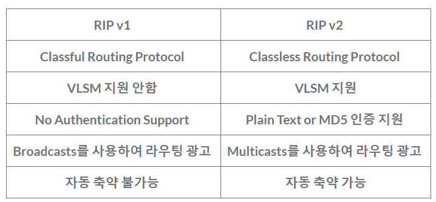

# 잔류 주말 발표

**TCP는 연속성보다 신뢰성 있는 전송이 중요할 때 사용되는 프로토콜이며,** **UDP는 TCP보다 빠르고 네트워크 부하가 적다는 장점이 있지만, 신뢰성 있는 데이터 전송을 보장하지는 않는다.**

## DNS

- Domain Name System
- 사람이 이해하기 쉬운 **도메인** 이름을 컴퓨터가 이해할 수 있는 **IP 주소**로 바꾸는 역할을 한다
- 도메인 이름 해석, 호스트와 도메인 관리, 분산된 시스템(전 세계적으로 분산되어있어 인터넷 확장과 안정적 동작이 가능함), 분산계층구조(TLD, Top -Level Domain에서 시작해 하위 도메인(Subdomain)으로 이어져 도메인 이름을 관리한다) ex) : blog.example.com.
- 포트는 TCP와 UDP포트 53번을 사용한다

## Radius

- Remote Authentication Dial-In User Service
- **AAA기능 구현**을 위한 인증 프로토콜
- AAA
    - 불법적인 네트워크 서비스 사용을 방지하고자 사용자 인증, 권한제어, 과금을 위해 다양한 네트워크 기술과 플랫폼들에 대한 개별 규칙들을 조화시키기 위한 프레임워크
    - Authentication/인증: 망, 시스템 접근을 허용하기 전에 사용자의 신원을 검증
    - Authorization/인가: 검증된 사용자에게 특정 수준의 권한과 서비스를 허용
    - Accounting/계정 관리: 사용자의 자원에 대한 사용 정보를 수집하여 이에 대해 감사 및 보고를 수행
    
- 중앙 통합 관리 - 분산되어있는 클라이언트, 사용자의 정보를 중앙에서 관리 가능
- 서비스 확장 - 다수의 서비스 제공자와 다중 도메인 환경에서 동작 가능
- 기본적으로 UDP 통신을 하며 1812포트는 서버로 인증 요청을 보내기 위해 사용
- 1813 포트는 서버로 계정 정보를 보낼때 사용

## SMTP

- Simple Mail Transfer Protocol
- 일반적으로 전자 메일 전송을 위한 표준 프로토콜
- 메일을 작성해서 보내면 그 메일은 SMTP 서버(보내는 메일서버, Outgoing mailserver)로 일단 전송되며 이 SMTP 서버에서 SENDMAIL ****프로그램을 구동하여 해당 메일 주소로 메일을 보내게 됨
- 이러한 역할을 하는것을 SMTP 서버, 보내는 메일 서버, Outgoing Mailserver라고 함
- SMPT의 포트는 다양한 시기와 다양한 상황에서 25, 465, 587, 2525 포트가 사용되어 왔음

## Pop3

- Post Office Protocol
- 앞서 말한 SMPT와 연관된 프로토콜
- 메일 서버에 도착한 메일을 클라이언트로 가져올 때 사용
- 메일을 서버에서 다운로드 받으면 서버의 메일은 삭제되는 특징이 있음
- TCP 110번 포트를 사용
- 비슷한 프로토콜로는 IMAP(Internet mail access protocol)이 있음 다른 점은 Pop3와 달리 메일을 다운로드 받아도 서버의 메세지가 그대로 저장된다는 점이다
- IMAP는 서버에 메일이 저장되어 인터넷이 되는 상황에서 메일을 볼 수 있고 Pop3는 클라이언트에 메세지를 가져오는 방식이라 오프라인 상태에서도 메일을 읽을 수 있다는 차이가 있다(서버에 저장이 되지 않아 부하를 주지 않는다는 장점도 있음)
- TCP 110번 포트를 사용

## OSPF

- Open Shortest Path First
- 관리자가 일일히 경로를 지정하지 않아도 패킷이 경로를 찾아나가는 다이나믹 라우팅 프로토콜(Dynamic routing protocol)의 방식 중 링크 상태를 확인해 최단경로를 바탕으로 패킷을 전달해주는 라우팅 프로토콜
- OSPF는 area 단위로 구성되어서 대규모 네트워크에 용이함
- OSPF는 TCP나 UDP와 같은 프로토콜을 사용하지 않고 IP 프로토콜의 89번 번호를 사용합니다

## RIP

- Routing Information Protocol
- 자동 축약 기능 - **네트워크의 공통되는 부분을 정리하여 하나의 네트워크로 묶는것(메모리, CPU등의 자원 낭비를 막고자 하는것)**
- Broadcast  - 로컬 네트워크에 연결되어 있는 모든 시스템에게 프레임을 보내는 방식
- Multicast - 네트워크에 연결되어 있는 시스템 중 일부에게만 정보를 전송하는 것
- RIP는 네트워크 간의 경로 정보를 교환하고 최적의 경로를 찾는 데 사용되며, 주로 작은 규모의 로컬 네트워크에서나 간단한 환경에서 라우팅을 관리하는 데 적합
- 홉 카운트 - RIP는 경로의 길이를 홉(hop) 수로 측정합니다. 홉 수는 패킷이 한 라우터에서 다음 라우터로 전달될 때마다 증가하며, 최소 홉 수 경로를 선택합니다.
- RIP는 라우팅 결정을 위해 홉 수만을 고려하므로 경로 선택이 항상 최적이 아닐 수 있음
- 대규모 네트워크 또는 더 복잡한 경우에는 앞서 말한 OSPF 등을 이용할 수 있음
- 포트는 UDP 520, 521을 사용한다

## EIGRP

- Enhanced Interior Gateway Routing Protocol
- Distance Vector + Link - State 방식이 합쳐진 프로토콜
- EIGRP는 IPv4와 IPv6를 모두 지원하며, 여러 프로토콜 스택에서 사용할 수 있음
- EIGRP는 VLSM(Virtual Length Subnet Mask)을 지원하므로 서브넷의 크기를 유연하게 조절할 수 있음(ip주소 효율적 할당에 도움)
- **Cisco 전용 프로토콜**이였지만 최근에는 다른 회사 기종도 지원되기 시작
- EIGRP는 특정 포트 번호를 사용하지 않고 IP 프로토콜을 사용해 88(ipv4), 90(ipv6)번을 통해서 라우팅 정보 전송을 함
- DUAL(Diffusing Update Algorithm) 알고리즘을 사용
    - Successor(최적경로)와 Feasible Successor(후속경로)를 선출