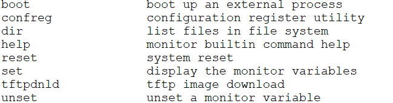
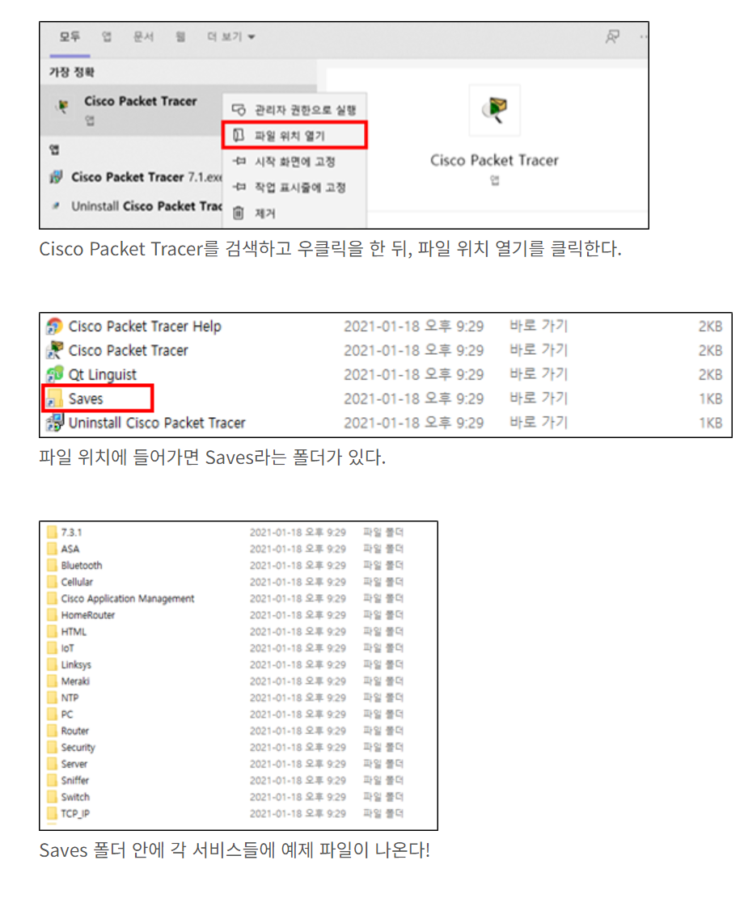

# Cisco command
# commands

- reload - 시스코 스위치와 라우터를 재시작 시키는 명령어
- hostname - 장치의 내부적인 이름을 바꿀때 씀
- copy running-config startup-config - 대충 저장할때 쓰는거
- shutdown, no shutdown - 대부분 int로 정한 포트를 활성화, 비활성화 할떄 쓰임
- **ip default-gateway *ip-address -*** 해당 장치의 default  gateway를 결정할떄 쓰임
- line [console, vty] - console이나 vty 회선으로 라우터에 접속할 수 있다
    - password *password -* line [console, vty]의 암호를 설정
- show ip interface - 이 명령어를 이용해 인터페이스에 설정된 모든 IP주소를 볼 수 있음
- copy running-config startup-config - 라우터의 설정 파일은 RAM안의 running-config로 저장되는데 RAM은 전원이 꺼지면 초기화 되므로 startup-config을 침으로서 running-config을 starting config에 카피해 라우터 부팅때 startup-config가 읽혀지므로 설정이 반영된 상태로 시작함
- show ip route - 라우팅 테이블을 표시
- show ip ospf neighbor - ospf 정보를 표시
- description - 인터페이스에 설명을 추가

## VLAN commands

- show vlan, show vlan brief - 모든 인터페이스의 vlan을 보여줌, 하지만 트렁크는 포함되지 않음
- vlan **[***vlan number***]**- vlan을 생성하고 추후 vlan의 세부사항을 설정하기 위한 발판이 된다
- vlan**[00]** name *[vlan-name***] -**  특정 vlan을 설정 후 이름을 설정
- vlan database - 스위치의 vlan 데이터베이스 모드로 진입
- show mac address-table - mac 주소 테이블을 표시
- clear mac address-table dynamic - 동적으로 학습된 mac주소를 삭제함

## Troubleshotting Commands(문제 해결)

- ping *0.0.0.0 -* 해당 주소로 패킷을 보내 통신이 되는지 확인함
- duplex *auto, full, half -* 해당 포트의 속도를 설정함
    - half - 한쪽만 통신이 가능한 상태, 한쪽이 멈추면 다른쪽이 작동함
    - full - full은 half와 다르게 두쪽 다 통신이 가능한 상태이다
    - auto - auto는 상대의 상태에 따라 그때그때 바뀌는 방식이다
- **show mac address-table** - 해당 장치의 MAC address table을 보여줌
- show vtp status - current mode를 포함한 vtp의 상태를 보여줌

## routing commands

- router rip - 라우터의 RIP모드를 활성화 시킴
- **network** *ip-address -* configuration mode에서  RIP모드에 network를 연결시킴
- version 2 - RIP 모드에서 version을 2로 바꿈으로서 version 2의 패킷만을 송수신 할수 있게 한다
- no auto-summary - 자동 저장을 비활성화하는 명령어
- show ip rip database - RIP 라우팅 데이터베이스를 보여준다
- ip nat [*inside | outside*] - 해당 인터페이스로 향하는 트래픽을 NAT의 inside, outside인지를 정한다.
- switchport access vlan - 스위치 인터페이스에서 access할 vlan을 선택한**다**
- **switchport turnk encapsulation dot1q** -  트렁크에 802.1Q를 지정한다
- switchport access - int로 선정한 포트를 vlan에 할당한다
- switchport mode [*access | trunk*] - 정해진 포트를 access하거나 트렁크 포트를 할당한다
- router ospf [*id*] - 라우터에서 ospf라우팅을 활성화하며 *id*는 임의 숫자이며 모든 네트워크에서 동일해야함
- network [*ip address*][*wild mask*] - IP address는 OSPF에서 애드버타이즈할 네트워크의 IP이며 와일드카드 마스크는 네트워크 비트를 나타냄
    - *wild mask -* 서브넷 마스크의 반전된 주소로 255.255.255.0 이 서브넷이라면 와일드마스크는 0.0.0.255가 된다
- router eigrp [*num*] - EIGRP(Enhanced Interior Gateway Routing Protocol) 구성 모드로 진입
- router bgp [*num*] -  BGP(Border Gateway Protocol) 구성 모드로 진입
- copy tftp: running- config - tftp 서버에서 실행중인 구성으로 복사해 작동

## DHCP commands

- ip dhcp pool ***name -*** dhcp의 범위와 이름을 설정하고 dhcp모드로 들어가기위한 명령어
- domain-name *domain -* DHCP 클라이언트들의 domain 이름을 설정할 때 사용
- **network [***network-id + subnet mask] -* dhcp 구성 모드에서 cisco ios dhcp 서버의 주소 범위나 보조 서브넷에 대한 네트워크주소, 서브넷마스크를 구성하는데 이용
- default-router *address -* dhcp 구성 모드에서 클라이언트에 대한 기본 라우터 목록을 지정함

## Security Commands

- password *password -* 로그인이 구성된 후 해당 계정으로의 로그인 암호를 설정한다
- username ***name*** password ***password** -*  사용자 인증에 사용되는 이름 및 암호에 관련된 전역 명령어
- enable **password | secret -** 둘다 암호를 설정하는 명령어지만 password는 show 명령어를 사용할 시 명령어가 보이는 반면 secret는 그렇지 않다
- crypto key generate rsa - RSA 암호화 키 쌍을 생성
- crypto isakmp policy [*num*] - ISAKMP (Internet Security Association and Key Management Protocol) 정책을 설정
- **crypto ipsec transform-set - [트랜스폼셋_이름] [암호화_알고리즘] [해시_알고리즘] [인증_메소드]**: IPsec 변환 세트를 설정합니다.

## Else commands

- ? - 현재의 인터페이스에서 작성[*실행*] 가능한 명령어들을 나열함
- exit - 현재의 인터페이스 상태에서 벗어남
- end - 사용중인 인터페이스를 enable 상태로 되돌림
- show tech-support - 기술적 지원 정보를 표시
- debug [debug_command] - 디버그 메세지 활성
- show version - 시스코 장치의 소프트웨어 버젼 및 하드웨어 정보를 표시
- show inventory - 하드웨어 컴포넌트의 자세한 정보를 표시
- clear line [*line num*] - 사용자 라인을 클리어하고 현재 연결을 해제함
- show users - 현재 사용자 목록을 표시

---

## additional commands

- rommon> - 라우터나 스위치가 부팅중 에러가 생기면 rommon 모드로 진입이 될 때가 있음 해당 모드는 패스워드 복구, 파일 복구 등이 가능한 모드임. 추가적으로 rommon 모드에 접속하기위해서는 reload 명령어를 입력해 장비가 부팅중일때 Ctrl + c를 입력하면 rommon모드로 진입 가능함
- boot - rommon모드에서 탈출하기 위한 명령어, rommon모드에서 설정한 명령어를 적용시키는 역할도 함
- 해당 모드에서는 아래와 같이 ip addr, subnetmask, default router등을 설정하고 tftpdnld로 적용시켜 재기동시키는게 가능함

---

> link
> 

[Cisco Commands Cheat Sheet](https://www.netwrix.com/cisco_commands_cheat_sheet.html)

[Cisco Commands Cheat Sheet - Learn the Most Important IOS CLI cmds!](https://www.pcwdld.com/cisco-commands-cheat-sheet)

- 예제 문제
    
  
    

> 댓글 및 문의사항 (Ctrl + Shift + M)
>