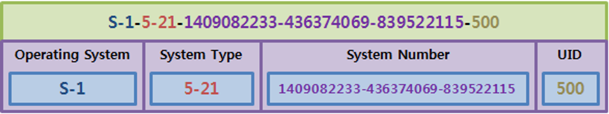
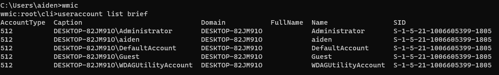

# Windows SID (Security Identifier)


## **SID란?**

- 사용자 계정은 처음 생성 할 때 자동으로 보안 식별자(SID)를 할당받게 됨
- 이 보안 식별자는 계정을 식별하는 유일한 번호
- 한번 설치 후 다시 재설치하더라도 다시 생성된지 않음(계정삭제시 기존 SID 삭제)

## **SID의 구조**

계정별 SID 구조(Windows 2008 테스트 예)



- S-1 : 윈도우 시스템 자체를 의미
- 5 -21: 시스템이 도메인 컨트롤러이거나 단독시스템(stand-alone)임을 의미
- 1409082233-436374069-839522115: 해당 시스템만의 고유한 식별자, 동일한 컴퓨터에 다시 윈도우를 설치해도 동일한 값을 가지지 앟음
- 500: 사용자 식별자(ID)(ex. 500: 관리자(Administrator) 식별자, 501: 게스트(Guest)식별자, 1000이상: 일반 사용자 식별자)

---

### **EX) S-1-5-21-3623811015-3361044348-30300820-1013**

1. S : SID를 의미
2. -1 : Revision number: 버젼 번호
    1. Revision Number
    
    ```vbnet
    1. **Windows NT 3.1 SID (S-1-):** 초기 버전으로, Windows NT 3.1에서 처음 도입
    2. **Windows 2000 SID (S-1-5):** Windows 2000에서 도입된 버전으로, Windows NT 4.0에서의 SID 구조를 개선
    3. **Windows Vista 이후 SID (S-1-5):** Windows Vista 및 그 이후 버전에서 사용되는 SID 구조로, 이전 버전과 호환성을 유지하면서 새로운 보안 기능을 지원
    ```
    
3. 5 : ID authority value
    
    ```vbnet
    1. 0 : NULL Authority (권한 없음) - 일반적으로는 의미 있는 권한이 없다는것을 나타냄
    2. 1 : World Authority (워드 권한) - 모든 객체에 대한 권한을 나타냄 (일반적으로 사람이나 그룹에는 할당되지 않음)
    3. 2 : Local Authoirty (로컬 권한) - 로컬시스템 또는 도메인의 로컬 그룹을 나타냄
    4. 3 : Creator Authority (작성자 권한) - 객체를 만든 개체에 대한 권한
    5. 4 : Non-unique Authority (빅고유 권한) - 중복되지 않는 SID를 생성할 때, 사용되는 권한을 나타냄
    6. 5 : NT Authority (NT 권한) - 기본 NT 권한을 나타냄 (가장 흔하게 사용되는 권한 중 하나)
    7. 9 : Resource Manager Authority (리소스 관리자 권한) - 리소스 관리자와 관련된 권한을 나타냄 (일반적으로 특정 리소스에 대한 권한을 부여할 때 사용)
    ```
    
4. -21: iD authority value, NT 권한을 나타냄 
    - NT 권한이란 Windows NT 계열 운영체제 및 이후 버전에서 사용되는 표준적인 권한 체계를 말함
    - 추가적으로 Windows 도메인 또는 로컬 시스템을 식별했다는 것을 의미
5. 3623811015-3361044348-30300820: 도메인 식별자
    - 시스템의 고유한 숫자
6. 1013: RID(Relative ID, 상대 식별자)
    - 관리자는 500번, Guest는 501번, 일반 사용자는 1000번 이상의 숫자를 가짐

## **잘 알려진 SID**

| SID | 의미 |
| --- | --- |
| S-1-1-0 | 모든 사용자 |
| S-1-5-14 | 원격 상호 로그온 접속 (Remote Interactive Logon) |
| S-1-5-18 | 로컬 시스템(Local System) - 운영체제가 사용하는 서비스 계정 |
| S-1-5-19 | NT 권한, 로컬 서비스 |
| S-1-5-20 | NT 권한, 네트워크 서비스 |
| S-1-5-29 | 네트워크 서비스 |
| S-1-5-domain-500 | 시스템 관리자를 위한 사용자 계정. 기본적으로 시스템 전반을 제어할 수 있는 유일한 사용자 계정 |
| S-1-5-domain-501 | 개인 계정이 없는 게스트 사용자 계정. 이 사용자 계정은 암호를 요구하지 않음, 기본적으로 게스트 계정은 활성화 되지 않음 |
| S-1-5-domain-512 | 도메인 관리자(Domain Admins) - 소속된 사용자들이 도메인을 관리할 수 있는 전역 그룹. 기본적으로 도메인 관리자 그룹은 도메인 컨트롤러를 포함하여 도메인에 참가하는 모든 컴퓨터의 관리자 그룹 멤버. |
| 도메인 관리자는 임의의 그룹 멤버가 만든 객체의 기본 소유자이다. |  |
| S-1-5-domain-513 | 도메인 사용자 (Domain Users) |
| S-1-5-domain-514 | 도메인 게스트(Domain Guests) - 기본적으로 도메인 내장 게스트 계정, 한명의 멤버만을 가지는 전역 그룹 |
| S-1-6 | 사이트 서버 권한(Site Server Authority) |
| S-1-7 | 인터넷 사이트 권한(Internet Site Authority) |
| S-1-8 | 교환 권한(Exchange Authority) |
| S-1-9 | 리소스 관리자 권한(Resource Manager Authority) |

## **SID 확인**

- 윈도우 관리 명령 콘솔(WMIC: Window Management Instruction Console)을 통해 확인 가능
- 실행 → wmic → useraccount list brief 실행



> Domain으로 구성되어 5-21 인 것을 확인
>