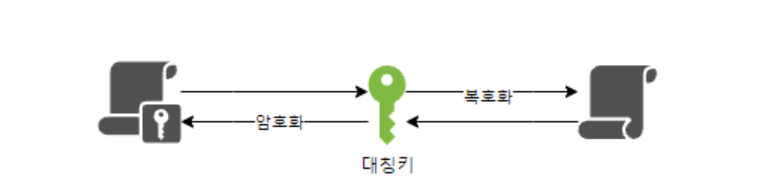
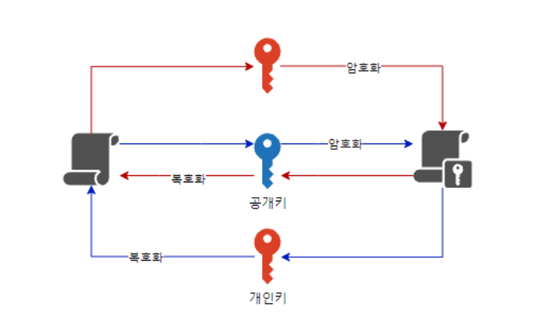
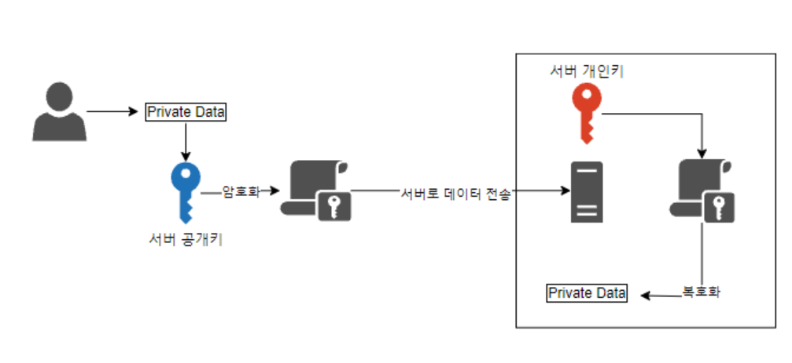
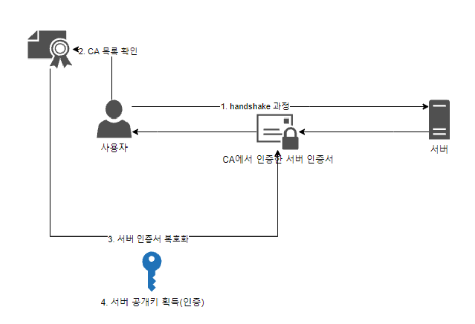
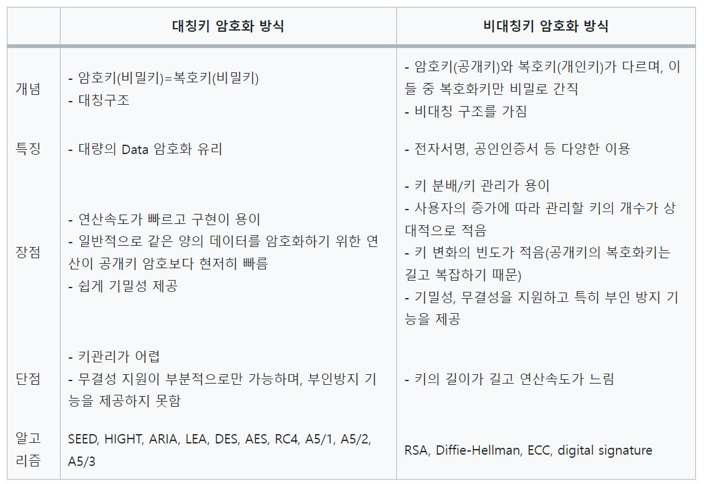

# 대칭키와 비대칭키(공개키)

# 대칭키와 비대칭키(공개키)

- 대칭키 암호화 방식(symmetric-key security method): 암호화, 복호화에 사용하는 키가 동일하다
- 비대칭키(공개키) 암호화 방식(asymmetric-key security method): 암호화, 복호화에 사용하는 키가 서로 다르다

# 대칭키 암호화 방식

- 양방향 암호화 방식 중 널리 사용하는 대칭키 암호화 방식은 **암호화와 복호화에 같은 암호키를 사용하는 알고리즘**
- Session Key, Secret Key, Shared Key, 대칭키, 단용키라고도 한다

## 장점 및 단점

> 장점
> 
> - 구현이 용이
> - 데이터를 암호화하기 위한 연산이 빨라 대용량 데이터 암호화에 적합
> - 기밀성 제공

> 단점
> 
> - 강한 보안을 위해 키를 주기적으로 교환하는 것이 좋음
> - 키 탈취 및 관리가 어려움
> - 무결성 지원이 부분적으로만 가능
> - 부인 방지 기능을 제공하지 못함
- 무결성 지원(Integrity): 무결성은 정보가 변경되지 않았음을 보장하는 것을 말함
    - 데이터의 무결성을 지원하는 암호화 시스템은 암호화된 데이터가 전송 중에 변조되거나 손상되지 않도록 보호
    - 대칭키 암호화에서는 주로 해시 함수가 사용되어 데이터의 무결성을 확인합니다. 해시 함수는 고정된 크기의 해시 값을 생성하는데, 이를 통해 데이터의 무결성을 검증할 수 있음
- 부인 방지 기능(Non-repudiation): 부인방지는 통신상에서 한 당사자가 자신의 행동을 부인하지 못하도록 하는 보안 기능을 의미
    - 대칭키 암호화에서는 주로 디지털 서명이나 인증서와 같은 메커니즘을 사용하여 메시지의 송신자를 확인하고, 그 송신자가 특정 행동을 부인하지 못하도록 함
    - 디지털 서명은 개인 키로 메시지를 서명하고, 공개 키로 검증함으로써 메시지의 출처를 입증하며, 송신자가 부인할 수 없도록 함
    
    ---
    

# 종류

- 블록 암호(block cipher)방식: 기밀성 있는 정보를 정해진 블록 단위로 암호화 하는 대칭키 암호 시스템으로 만약 암호화하려는 정보가 블록 길이보다 길 경우 특정한 운용 모드가 사용됨

> 종류
> 
> - SEED
> - HIGHT(High security and light weight)
> - ARIA
> - LEA(Lightweight Encryption Algorithm)
> - DES(Data Encryption Standard)
> - AES(Advanced Encryption Standard)

스트림 암호(Stream cipher)방식: 이진화된 평문 스트림과 이진 키스트림의 베타적 논리합(XOR)연산으로 암호문을 생성하는 방식

- RC4
- A5/1, A5/2, A5/3

# 비대칭키/공개키 암호화 방식

- 비대칭키/공개키는 **암호화할 때와 복호화할 때의 키를 서로 다른 키로 사용하는 암호화 알고리즘**
- **외부에 절대 노출되어서는 안되는 개인키(Private Key)와 공개적으로 개방되어 있는 공개키(Public Key)가 쌍으로 이루어진 형태**

## 장점 및 단점

장점

- **키 분배 및 키 관리가 용이**
- **기밀성, 무결성을 지원**
- **부인 방지 기능을 제공**
- 암호학적 문제를 해결 가능

단점

- 상대적으로 키의 길이가 김
- **연산속도가 느림**

# 종류

- RSA
- Diffie-Hellman
- Elliptic Curve Cryptosystem(ECC): 타웥곡선암호
- digital signature(전자서명)

# 비대칭키/공개키를 사용한 암호학적 문제 해결

비대칭키/공개키를 사용할 경우 2가지 암호학적 문제를 해결할 수 있다

- 데이터보안
- 인증

**공개키 암호화 → 개인키 암호화**: 데이터를 안전하게 전송할 수 있는 보안 관점

**개인키 암호화 → 공개키 암호화**: 신뢰할 수 있는 단체라는 것을 인증하는 관점

## 데이터 보안 관점

- 사용자가 데이터를 서버로 보내는 과정에서 개인정보와 같은 중요 데이터의 경우 암호화해서 보내야 함
- 그래서 서버만 유일하게 가지고 있는 개인키로 복호화할 수 있도록 하고 서버의 공개키로 암호화하여 해서 보내도록 하면 데이터를 안전하게 전송할 수 있음
- 즉, 제 3자가 클라이언트로부터 전송하는 데이터를 볼 수 없어 데이터 보안을 강화할 수 있음

## 인증 관점

1. 클라이언트와 서버는 서로 확인 위해 Handshake 과정을 진행한다.
    1.  이 때 서버에서는 CA(공인 인증 기관)에서 인증받은 인증서(CA의 개인키로 암호화된 전자서명)를 클라이언트로 보냄
2. 사용자는 CA의 목록을 확인해 공인 인증 기관이 서명한 인증서인지 확인
3. CA의 공개키를 이용해 해당 인증서를 복호화함
4. 복호화에 성공하면 서버의 공개키를 얻음

이러한 방식으로 공인 인증 기관으로부터 서명 받은 서버의 인증서가 공인 인증 기관의 공개키로 복호화가 가능하다는 것을 통해 해당 기관이 인증 받은 단체라는 것을 확인할 수 있음

# 대칭키와 비대칭키의 혼합

1. A가 B의 공개키로 암호화 통신에 사용할 대칭키를 암호화하고 B에게 보냄
2. B는 암호문을 받고, 자신의 비밀키로 복호화함
3. B는 A로부터 얻은 대칭키로 A에게 보낼 평문을 암호화하여 A에게 보냄
4. A는 자신의 대칭키로 암호문을 복호화함
5. 앞으로 이 대칭키로 암호화를 통신함

위와 같은 방식으로 대칭키와 비대칭키를 적절하게 혼합해 사용함으로써 2가지 방식의 장점을 적절하게 취할 수 있음

# 보안의 3요소

보안은 3가지 요소가 결합되어야 높은 안정성을 형성

- 기밀성: 인가받은 사용자만 정보 자산에 접근할 수 있음을 보장하는 것
- 무결성: 권한을 가진 사용자에 의해 인가된 방법으로만 정보를 변경할 수 있음을 보장하는 것
- 효율성: 정보에 대한 접근과 사용이 적시에 확실히 보장되는 것

# 요약

---
