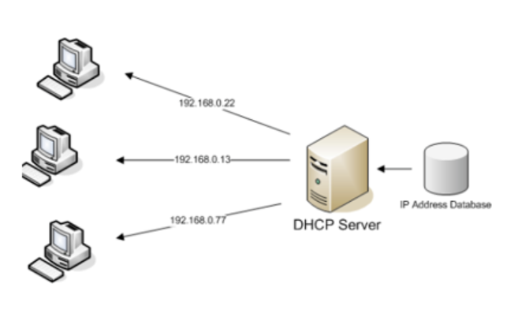
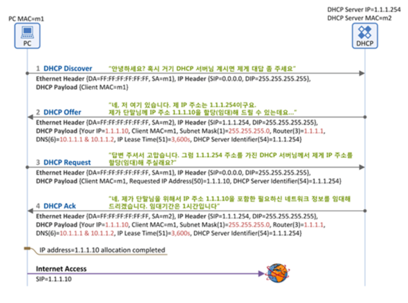

# DHCP
- 이거 모르면 안됀다

---

# DHCP

- DHCP는 Dynamic Host Configuration Protocol의 약자
- DHCP란 호스트의 IP주소와 각종 TCP/IP 프로토콜의 기본 설정을 클라이언트에게 자동적으로 제공해주는 프로토콜을 말함
- DHCP 지원 클라이언트는 네트워크 부팅과정에서 DHCP 서버에 IP 주소를 요청하고 이를 얻을 수 있음

---

## DHCP 장점

- 편리함
- PC의 수가 많거나 PC 자체 변동사항이 많은 경우 IP 설정이 자동으로 되기 때문에 효율적으로 사용 가능
- IP를 자동으로 할당해주기 때문에 IP 충돌을 막을 수 있

## DHCP 단점

- DHCP 서버에 의존하기 때문에 DHCP 서버에 문제가 생길 경우 IP 할당이 제대로 이루어지지 않는다

---

## DHCP 프로토콜의 원리

- DHCP를 통한 IP 주소 할당은 “임대”라는 개념을 가짐
- 이는 DHCP 서버가 IP 주소를 영구적으로 단말에 할당하는 것이 아니고 임대기간(IP Lease Time)을 명시하여 그 기간 동안만 단말이 IP 주소를 사용하도록 하는 것
- 단말은 임대기간 이후에도 계속 해당 IP 주소를 사용하고자 한다면 IP 주소 임대기간 연장(IP Address Renewal)을 DHCP 서버에 요청
- 단말은 임대 받은 IP 주소가 더 이상 필요치 않게 되면 IP 주소 반납 절차(IP Address Release)를 수행하게 됩니다.

### DHCP Discover

- 메세지의 방향: 단말 → DHCP 서버
- 주요 포함 내용: CLient의 맥 주소

### DHCP Offer

- 메세지 방향: DHCP 서버 → 단
- DHCP 서버가 "저 여기 있어요~"라고 응답하는 메시지
- 단순히 DHCP 서버의 존재만을 알리지 않고, 단말에 할당할 IP 주소 정보를 포함한 다양한 "네트워크 정보"를 함께 실어서 단말에 전달
- 주요 포함 내용
    - Client MAC: 단말의 MAC 주소
    - Your IP: 단말에 할당(임대)할 IP 주소
    - Subnet Mask (Option 1)- Router (Option 3): 단말의 Default Gateway IP 주소
    - DNS (Option 6): DNS 서버 IP 주소
    - IP Lease Time (Option 51): 단말이 IP 주소(Your IP)를 사용(임대)할 수 있는 기간(시간)
    - DHCP Server Identifier (Option 54): 본 메시지(DHCP Offer)를 보낸 DHCP 서버의 주소. 2개 이상의 DHCP 서버가 DHCP Offer를 보낼 수 있으므로 각 DHCP 서버는 자신의 IP 주소를 본 필드에 넣어서 단말에 보냄

### DHCP Request

- 메시지 방향: 단말 → DHCP 서버
- 단말은 DHCP 서버(들)의 존재를 알았고, DHCP 서버가 단말에 제공할 네트워크 정보(IP 주소, subnet mask, default gateway등)를 알았음
- 이제 단말은 DHCP Request 메시지를 통해 하나의 DHCP 서버를 선택하고 해당 서버에게 "단말이 사용할 네트워크 정보"를 요청
- 주요 포함 내용
    - Client MAC: 단말의 MAC 주소
    - Requested IP Address (Option 50): 난 이 IP 주소를 사용하겠다. (DHCP Offer의 Your IP 주소가 여기에 들어감)
    - DHCP Server Identifier (Option 54): 2대 이상의 DHCP 서버가 DHCP Offer를 보낸 경우, 단말은 이 중에 마음에 드는 DHCP 서버 하나를 고르게 되고,  그 서버의 IP 주소가 여기에 들어감. 즉, DHCP Server Identifier에 명시된DHCP서버에게"DHCP Request"메시지를 보내어 단말 IP 주소를 포함한 네트워크 정보를 얻는 것

## DHCP Ack

- 메세지 방향: DHCP 서버 → 단말
- DHCP 절차의 마지막 메시지
- DHCP 서버가 단말에게 "네트워크 정보"를 전달해 주는 메시지
- 앞서 설명한 DHCP Offer의 '네트워크 정보"와 동일한 파라미터가 포함
- 주요 포함 내용
    - Client MAC: 단말의 MAC 주소
    - Your IP: 단말에 할당(임대)할 IP 주소
    - Subnet Mask (Option 1)
    - Router (Option 3): 단말의 Default Gateway IP 주소
    - DNS (Option 6): DNS 서버 IP 주소
    - IP Lease Time (Option 51): 단말이 본 IP 주소(Your IP)를 사용(임대)할 수 있는 기간(시간)
    - DHCP Server Identifier (Option 54): 본 메시지(DHCP Ack)를 보낸 DHCP 서버의 주소
- 이렇게 DHCP Ack를 수신한 단말은 이제 IP 주소를 포함한 네트워크 정보를 획득(임대)하였고, 이제 인터넷 사용이 가능하게 됨