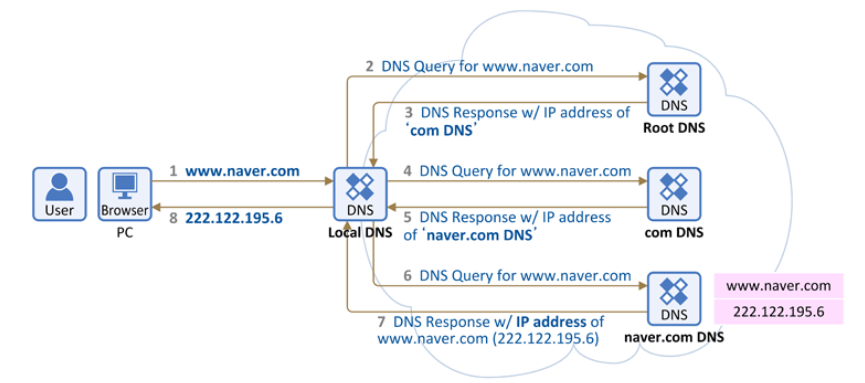

# DNS
- DNS 기본 동작 방식 알아두기
- Root - TLD - Authentication 구조 이해하기
- Linux DNS View 공부하기

---

## DNS 동작 방식

- 사용자가 도메인 주소를 브라우저 창에 입력해 요청을 보낼 때, 해당 주소로 바로 이동하는것이 아님
- 요청은 먼저 여러 domain 주소와 IP 주소를 매칭시켜 놓은 DNS 서버에 전달되어, 원하는 domain의 IP 주소가 존재하는지 묻는 쿼리를 보냄
- 응답값으로 요청한 IP 주소를 받게되면, 그 후에 해당 IP 주소로 패킷을 보냄
    - 도메인은 계층구조이기 때문에 상위 도메인부터 하위 단계의 순서대로 주소를 찾아감
    - .com -> .google -> www 순으로 주소 검색이 진행되며, 이 순서대로 도메인 연결 부분이 하나씩 늘어나며 최종 도메인 주소를 구성
    - 도메인 계층은 최대 128계층까지 구성가능하며 계층별 길이는 최대 63바이트까지 사용가능
    - 문자는 알파벳, 숫자, - 만 사용가능

- 1번을 보면 마침표도 도메인 주소를 구성하는 부분임을 알 수 있음
- 원래는 최상위 도메인 끝에 .이 하나 더 붙는데, 이를 `root domain`이라고 함
- 인터넷 도메인의 체계에서 최상위는 루트(Root)로서 인터넷 도메인의 시작점이 된다

### ❗root domain은 subdomain이 없는 domain을 의미하기도 함

## DNS 체계를 이용해 IP주소를 받아오는 과정

1. 웹 브라우저 창에 도메인 주소 입력 -> 로컬 컴퓨터의 캐시에 해당 도메인의 IP 가 저장되어 있는지 확인

1-1. 있는 경우 바로 해당 IP 주소로 패킷 전송, 없는 경우 로컬 DNS 서버로 쿼리

1. DNS 서버의 캐시 및 주소록에서 IP 주소 검색

2-1. 있는 경우 바로 해당 IP 주소로 패킷 전송, 없는 경우 연결된 Root DNS 서버로 쿼리

1. Root DNS 서버 (최상위 도메인에 대한 권한이 있는 네임 서버 목록을 반환하는 도메인 네임 서버이며, 전 세계에 13대밖에 없다.) 에서 도메인의 TLD 정보를 가지고 있는 하위 DNS 서버 IP 요청 (".com" )
2. 하위 DNS 서버에서 다음 계층의 주소를 포함하는 도메인 주소의 정보를 가지고 있는 하위 DNS 서버 IP 요청 ("[google.com](http://google.com/)")
3. 같은 방식으로 계층 하나씩 이동하며 최종 domain 의 IP 주소를 받을 때까지 쿼리 반복
4. 마지막으로 IP 주소를 로컬 DNS 와 브라우저 PC 에 캐싱한 뒤 패킷 전송

---

💡 클라이언트에서 로컬 DNS 서버로 보내는 요청을 재귀적 (recursive) 쿼리 라고 한다.

💡 로컬 DNS 에서 root DNS 서버 & 하위 DNS 서버에 보내는 요청을 반복적 (iterative) 쿼리 라고 한다.

---

## Root - TLD - Authentication구조

### Root

- DNS 계층 구조에서 가장 상위에 위치한 레벨
- 루트는 모든 도메인 네임 계층의 시작점으로 간주
- 루트 레벨에는 “**dot”** 또는 “**.”** 으로 표시되는 루트 도메인이 있음

### TLD (Top-Level Domain)

- TLD는 DNS 계층주고에서 루트 다음으로 오는 레벨
- 일반적인 최상위 도메인에는 구가코드 최상위 도메인 (ccTLD)와 일반 최상위 도메인(gTLD)이 있음
- 예시로 ".com", ".org", ".net"은 일반 최상위 도메인이며, ".us", ".uk", ".jp"는 국가 코드 최상위 도메인입니다.

### Authentication(인증)

- DNS 인증은 DNSSEC (DNS Security Extensions)를 통해 제공됨
- DNSSEC는 DNS응답을 위조하거나 수정, 공격으로부터 domain name을 보호
- 각 DNS 레코드는 디지털 서명을 보호되어 해당 레코드의 무결성을 확인
- DNSSEC는 인터넷 사용자가 정확한 domain name service를 받을 수 있도록 함
