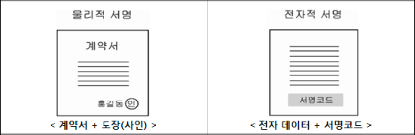
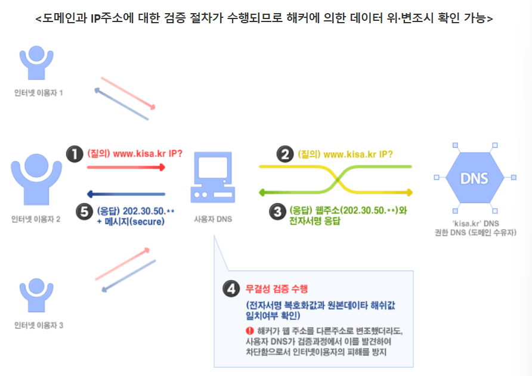
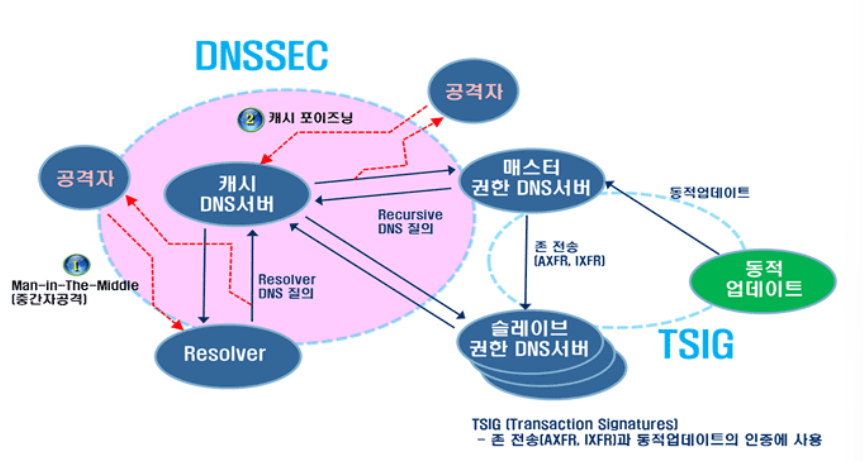

# DNSSEC

- DNSSEC에서 사용되는 Flag 공부하기
- DNSSEC을 사용하여 어떻게 Record의 위조 및 변조를 방지하는지 공부해보기.

---

# DNSSEC

- DNSSEC(DNS Security Extensions)은 DNS 데이터 대상의 `데이터 위조-변조 공격`을 방지하기 위한 인터넷 표준 기술

## DNSSEC의 FLAG

- DNSSEC는 DNS데이터의 무결성과 인증을 강화하기 위한 보안 확장
- DNSSEC는 여러 FLAG를 사용해 다양한 설정을 나타냄

### Query(QR - Query Response)

- 0(Query), 1(Response)
- Query flag는 DNS 패킷이 쿼리인지 응답인지를 나타냄
- 0은 쿼리를 1은 응답을 나타냄

### Authoritative Answer (AA)

- 값: 0 (Non-authoritative), 1 (Authoritative)
- Authoritative Answer 플래그는 DNS 서버의 응답이 권한 있는 응답인지를 나타냄
- 1은 권한이 있는 응답, 0은 비권한 응답을 나타냄

### Truncation (TC)

- 값: 0 (Not truncated), 1 (Truncated)
- Truncation 플래그는 DNS 메세지가 전체 응답을 포함하지 못하고 잘린 경우 1로 설정됨

### Recursion Desired (RD)

- 값 : 0 (Recursion not desired), 1 (Recursion desired)
- Recursion Desired 플래그는 DNS 클라이언트가 재귀적인 해결을 원하는 경우 1로 설정됨

### Recursion Available (RA)

- 값 : 0 (Recursion not available), 1 (Recursion available)
- Recursion Available 플래그는 DNS 서버가 재귀적인 해결을 지원하는 경우 1로 설정

### Authenticated Data (AD)

- 값 ; 0 (Not authenticated), 1 (Checking disabled)
- Authenticated  Data 플래그는 DNSSEC에 사용되며, 1로 설정되면 DNS 데이터가 인증된 것으로 간주

### Checking Disabled (CD)

- 값 : 0 (Checking enabled), 1 (Checking disabled)
- Checking Disabled 플래그는 DNSSEC 데이터의 유효성을 확인하는 작업이 비활성화되었는지를 나타냄

---

- DNS 데이터의 위조-변조 가능성을 원천적으로 차단하기 위해, DNSSEC는 `공개키 암호화방식(Public Key Cryptography)`의 전자서명 기술을 DNS 체계에 도입 적용함 `(공인인증서)`

### 보안침해 공격에 대한 DNSSEC이 제공하는 보안성 범위

|                공격 유형 |              방어여부 |                                            비고 |
| --- | --- | --- |
|      파밍(캐시 포이즈닝)  |             방어/방지 |      -DNS 데이터 위-변조 방식 이용 공격에 효과적 대응 |
|                   피싱 |             해당없음 | -피싱은 유사 도메인네임 사용하지만, 데이터 위-변조에 해당하지 않음 |
|               DDoS 공격 |             해당없음 | -DDoS 공격방어 메커니즘이 아님 |
|     웜바이러스에 의한                   호스트 정보 변조 |             해당없음 | - DNSSEC은 DNS 질의응답 절차관련 “데이터 위-변조 방지기술”임 |

## DNS 구성체계 중 DNSSEC이 제공하는 보안 안전성 범위

- DNSSEC는 인터넷 상의 도메인에 대한 DNS 질의응답 절차 가운데 발생할 수 있는 “DNS 데이터 위-변조” 공격에 대응할 수 있는 보안기술
- 권한 DNS 서버간 존 데이터 전송 또는 동적업데이트와 같은 네임서버 관리영역의 동작에 대해서는 별도의 공유키 암호화 방식인 TSIG 기술을 사용하여 보호체계를 적용할 수 있음

