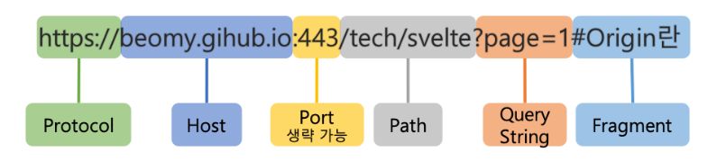
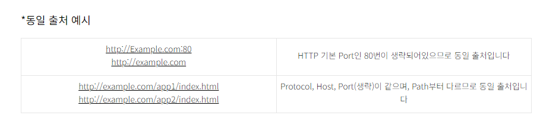
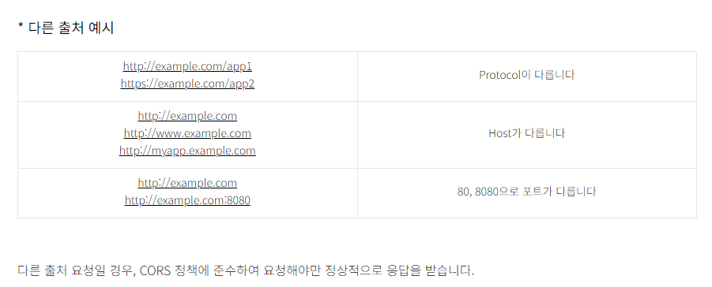

# CORS란

---

## CORS란?

- CORS(Cross-Origin Resource Sharing)은 출처가 다른 자원들을 공유한다는 뜻
- 한 출처에 있는 자원에서 다른 출처에 있는 자원에 접근하도록 하는 개념
- `교차되는 출처자원들의 공유`
- 다른 출처에 있는 자원을 요청한다고 하면, 이를 교차 출처 요청이라고 부름

> **교차 출처 리소스 공유**(Cross-Origin Resource Sharing, CORS) 추가 http 헤더를 사용하여, 한 출처에서 실행중인 웹 애플리케이션이 다른 출처의 선택한 자원에 접근할 수 있는 권한을 부여하도록 브라우저에 알려주는 체제
> 

## Origin(출처)란?

위의 구성요소 중에서 **Protocol + Host + Port** 3가지가 같으면 동일 출처 (Origin)이라고 한다

## Simple Request

- 일반적인 HTTP 메서드(GET, POST, HEAD)와 특정 헤더를 사용하지 않거나, 사용 가능한 헤더에 대한 제한이 있는 경우, 브라우저는 “SImple Request”로 처리
- Simple Request는 브라우저가 자동으로 CORS를 처리하므로 추가적인 설정이 필요하지 않음

## Preflighted request

- 복잡한 요청(complex request)을 보낼 때는 브라우저가 사전 확인(preflight) 요청을 보냅니다.
- Preflighted Request는 OPTIONS 메서드를 사용하며, 서버는 이에 대한 응답으로 허용 여부를 전달합니다.
- 허용되면 실제 요청을 보내고, 그렇지 않으면 브라우저에서 에러를 발생시킵니다.

## **CORS Headers:**

- 서버는 클라이언트에게 CORS 헤더를 포함하여 리소스 접근 규칙을 전달합니다.
- 주요 CORS 헤더는 다음과 같습니다:
    - **`Access-Control-Allow-Origin`**: 허용된 출처를 지정.
    - **`Access-Control-Allow-Methods`**: 허용된 HTTP 메서드를 지정.
    - **`Access-Control-Allow-Headers`**: 허용된 헤더를 지정.
    - **`Access-Control-Allow-Credentials`**: 쿠키 및 자격 증명을 허용할지 여부를 지정.
    - **`Access-Control-Expose-Headers`**: 브라우저가 액세스할 수 있는 헤더를 지정.