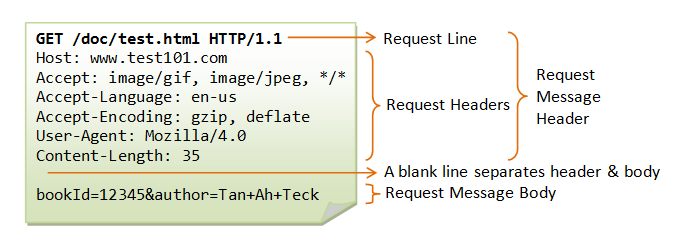
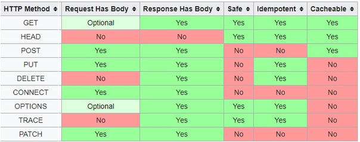

# http message 구조 (Request message, Response Message)

---

## HTTP Request Message format



- HTTP는 Request를 전송하고, Response를 전송받는 형태
- HTTP Request Message는 Start Line, Headers, Message Body로 이루어져 있다
- Header와 Body 사이에는 한줄 공백이 있다

## Request Start Line

- Request Start Line 은 HTTP Method와 Request Target, 프로토콜 버전으로 구성
- HTTP Method는 Get, Post등  HTTP 통신에서 사용되는 메소드
- Request Target는 주로 URl의 형태로 표현

## Request Headers

```vbnet
Header는 Start Line에서 표현되지 않은 더 구체적인 요구를 작성하는 공간이다.

- Host : 서버의 도메인 주소
- Connection : Keep-alive가 디폴트이며, HTTP/2에선 아예 사라진 헤더. 큰 의미가 없다.
- User-Agent : 사용자의 웹 브라우저 종류&버전 정보
- -----------------Accept 시리즈-----------------------
- Accept : 브라우저가 처리할 수 있는 데이터의 형태
- Accept-Charset : 브라우저가 처리할 수 있는 문자 인코딩 방법
- Accept-Language : 사용하는 언어
- Accept-Encoding : 브라우저가 처리할 수 있는 컨텐츠 압축 방식
- -----------------------------------------------
- Referer : 이전 페이지의 주소
- Cookie : 쿠키 정보
- ------------------Content 시리즈(Entity 헤더라고 부름)-------------
- Content-Length : 메세지의 본문 크기를 byte단위로 표시
- Content-Type : 컨텐츠의 타입과 문자열 인코딩 등을 명시
- Content-Language : 사용하는 언어
- Content-Encoding : 컨텐츠 압축 방식
- ---------------------------------------------

1번의 Request Start Line과 2번의 Request Headers를 합쳐서 Request Message Header라고 부른다.
```

## HTTP Request Method

- 서버에서 주어진 리소스에 수행하길 원하는 행동을 나타낸다
- 메소드에 따라 서버에서 여러가지 작업을 수행하도록 제작
- GET와 POST 이외에는 찾아보기 힘듬



### GET

- 리소스를 검색하고, 반환받기 위해 사용되는 메소드
- 원하는 정보를 서버에 요청할 때 쓰임
- (일반적으로) 리소스의 위치를 URL에서 쿼리로 펴현하기 때문에 Request Body가 없다

### HEAD

- 서버의 각종 정보를 확인하기 위해 사용되는 메소드
- GET와 동일하지만, response에 Body가 없고 response Code와 Head만 응답받는다

### POST

- 요청된 자원을 생성하기 위해 사용되는 메소드
- POST로 정보를 전송하면 URL에 파라미터가 나타나지 않으므로 각종 데이터를 전송하는데 쓰임

### PUT

- 요청된 자원을 수정하기 위해 사용되는 메소드

### PATCH

- 요청된 자원을 수정하기 위해 사용되는 메소드라는 점에서 PUT와 같지만, 
해당 자원 전체를 수정하는 PUT과는 다르게 PATCH는 해당 자원의 일부 부분을 수정한다

### DELETE

- 요청한 자원을 삭제하기 위해 사용되는 메소드
- 클라이언트에서 서버의 자원을 삭제할 수 있도록 하는 것은 매우 위험
- 현실적으로는 사용될 일이 거의 없으며. 대부분의 서버는 이 메소드를 비활성화 시킴

### TRACE

- 루프백 메시지를 호출하기 위해 테스트으로 사용되는 메소드

### OPTION

- 웹 서버에서 지원하는 메소드를 알기 위해 사용되는 메소드

### CONNECT

- 프락시 기능을 요청할 때 사용되는 메소드