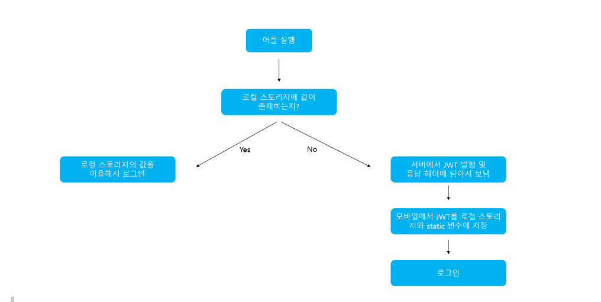
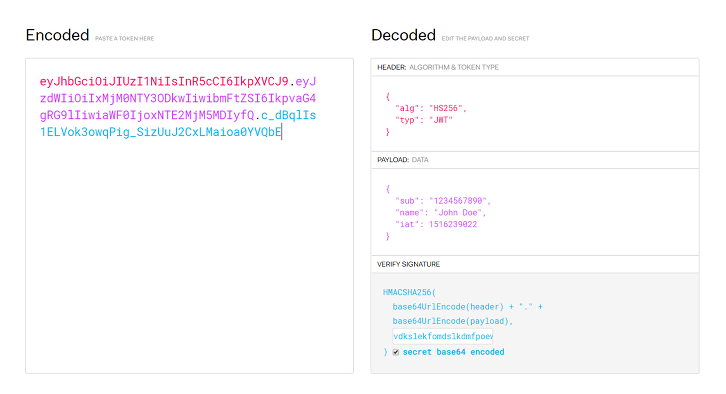
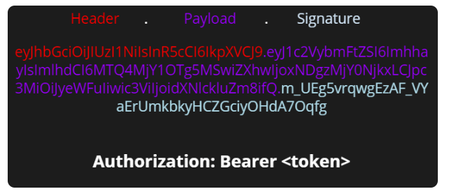

# JWT (Json Web Token) 란 무엇인가 ?

---

## JWT란

- JWT(Json Web Token)이란 Json 포캣을 이요하여 사용자에 대한 속성을 저장하는 Claim 기반의 Web Token이다
- JWT는 토큰 자체를 정보로 사용하는 Self-Contained 방식으로 정보를 안전하게 전달
- 주로 회원 인증이나 정보 전달에 사용되는 JWT는 아래의 로직을 따라 처리된다


- 애플리케이션이 실행될 때, JWT를 static 변수와 로컬 스토리지에 저장하게 된다
- static 변수에 저장되는 이유는 HTTP 통신을 할 때마다 JWT를 HTTP 헤더에 담아서 보내야 하는데, 이를 로컬 스토리지에서 계속 불러오면 오버헤드가 발생하기 때문
- 클라이언트에서 JWT를 포함해 요청을 보내면 서버는 허가된 JWT인지를 검사한다. 또한 로그아웃을 할 경우 로컬 스토리지에 저장된 JWT 데이터를 제거한다. (실제 서비스의 경우에는 로그아웃 시, 사용했던 토큰을 blacklist라는 DB 테이블에 넣어 해당 토큰의 접근을 막는 작업을 해주어야 한다.)

## JWT 구조

- JWT는 Header, Payload, Signature의 3 부분으로 이루어지며 Json형태인 `각 부분은 Base64Url로 인코딩`되어 표현된다
- 각각의 부분을 이어주기 위해 구분자를 사용하여 구분
- Base64Url는 암호화된 문자열이 아니고, 같은 문자열에 대해 항상 같은 인코딩 문자열을 반환



## Header

- 토큰의 헤더는 typ와 alg 두가지 정보로 구성됨
- alg는 헤더를 암호화 하는 것이 아니고 `signature를 해싱하기 위한 알고리즘을 지정`
    - typ: 토큰의 타입을 지정 ex) JWT
    - alg: 알고리즘 방식을 지정하며, 서명(signature) 및 토큰 검증에 사용 ex) HS256(SHA256) 또는 RSA
    
    ```vbnet
    { 
       "alg": "HS256",
       "typ": JWT
     }
    ```
    

## 2. PayLoad(페이로드)

- 토큰의 페이로드에는 토큰에서 사용할 정보의 조각들인클레임(Claim)이 담겨 있음
- 클레임은 총 3가지로 나누어지며, Json(Key/Value) 형태로 다수의 정보를 넣을 수 있다
1. 등록된 클레임 (Registered Claim)
    1. 등록된 클레임은 토큰 정보를 표현하기 위해 이미 정해진 종류의 데이터들
    2. 모두 선택적으로 작성이 가능
    3. JWT를 간결하게 하기 위해 key는 모두 길이 3의 String이다 
2. 공개 클래임 (Public Claim)
    1. 공개 클레임은 사용자 정의 클레임으로, 공개용 정보를 위해 사용된다
    2. 충돌 방지를 위해 URI 포맷을 이용한다
    
    ```vbnet
    {
    "https://mangkyu.tistory.com": true
    }
    ```
    
3. 비공개 클레임 (Private Claim)
    1. 비공개 클레임은 사용자 정의 클레임으로, 서버와 클라이언트 사이의 임의로 지정된 정보를 저장
    
    ```vbnet
    {
    "token_type": access
    }
    ```
    

## Signature (서명)

- 서명(Signature)은 토큰을 인코딩하거나 유효성 검증을 할 때 사용하는 고유한 암호화 코드
- 서명(Signature)은 위에서 만든 헤더(Header)와 페이로드(Payload)의 값을 각각 BASE64Url로 인코딩하고, 인코딩한 값을 비밀 키를 이용해 헤더(Header)에서 정의한 알고리즘으로 해싱을 하고, 이 값을 다시 BASE64Url로 인코딩하여 생성



- 생성된 토큰은 HTTP 통신을 할 때 Authorization이라는 key의 value로 사용된다. 일반적으로 value에는 Bearer이 앞에 붙여진다

```vbnet
{ 
    "Authorization": "Bearer {생성된 토큰 값}",
 }
```

## JWT 단점 및 고려사항

- Self-contained: 토큰 자체에 정보를 담고 있으므로 양날의 검이 될 수 있다
- 토큰 길이: 토큰의 페이로드(Payload)에 3종류의 클레임을 저장하기 때문에, 정보가 많아질수록 토큰의 길이가 늘어나 네트워크에 부하를 줄 수 있다
- Payload 인코딩: 페이로드(Payload) 자체는 암호화 된 것이 아니라, BASE64Url로 인코딩 된 것이다
    - 중간에 Payload를 탈취해 디코딩하면 데이터를 볼 수 있으므로 JWE로 암호화하거나 Paload에 중요 데이터를 넣지 않아야한다
- Stateless: JWT는 상태를 저장하지 않기 때문에 한번 만들어지면 제어가 불가능
    - 토큰을 임의로 삭제하는 것이 불가능하므로 토큰 만료 시간을 꼭 넣어주어야 한다
- Store Token: 토큰은 클라이언트 측에서 관리해야 하기 때문에, 토큰을 저장해야함