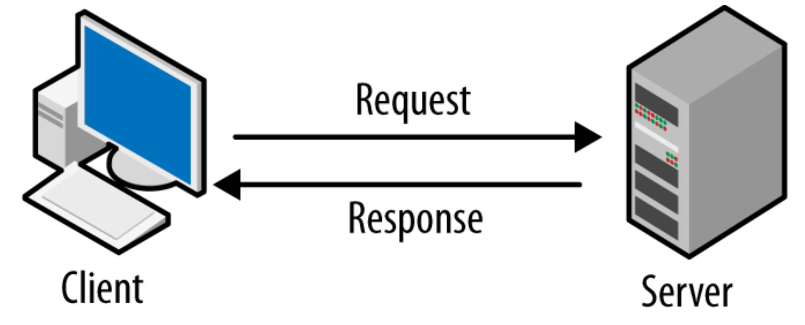
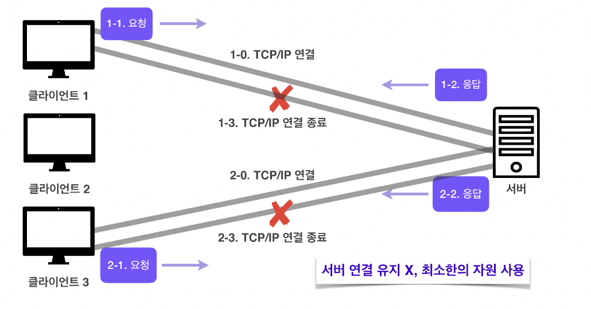

# HTTP protocol

---

# HTTP

- HTTP (Hypertext Transfer Protocol)은 웹 상에서 데이터를 주고받기 위한 프로토콜
- 웹에서 html을 불러오기위한 프로토콜
- 클라이언트(Web browser)와 서버간의 데이터 전송을 위한 규약을 제공함
- 클라이언트가 서버에 **요청**을 보내면, 서버가 요청에 대한 **응답**을 보내는 **클라이언트-서버 구조**로 이루어져있다.

# HTTP의 특징

## Stateless(무상태) 프로토콜

- **Stateless(무상태)**: 각 요청은  서버에 저장된 상태와 독립적임
    - 장점: 서버 확장성이 높다 | 무상태는 응답 서버를 쉽게 바꿀 수 있기 때문에 무한한 서버 증설이 가능하다
    - 단점: 클라이언트가 추가데이터를 전송해야한다
- 무상태(Stateless)의 한계
    - 로그인과 같이 유저의 상태를 유지해야하는 서비스라면, **브라우저 쿠키, 서버 세션, 토큰** 등을 이용해 상태를 유지해야한다.

## Connectionless(비연결성) 프로토콜

- **Connectionless(무연결성):** 클라이언트가 서버에 요청을 보내면 서버는 응답을 보내고 연결을 종료합니다. 각각의 요청은 독립적으로 처리됨.

### **Connection Oriented(연결을 유지하는 모델)**

- TCP/IP는 기본적으로 연결을 유지한다
- 연결을 유지하는 모델에서는 클라이언트가 요청을 보내지 않더라도 연결을 유지해야함
- 이 경우 연결을 유지하는 서버의 자원이 계속 소모됨

### **Connectionless(연결을 유지하지 않는 모델)**

- 비연결성을 가지는 HTTP에서는 실제로 요청을 주고받을 때만 연결을 유지하고 **응답을 주고나면 TCP/IP 연결을 끊는다**
- 이를 통해 최소한의 자원으로 서버를 유지할 수 있다.

## HTTP의 비연결성

- HTTP 1.0을 기준으로, HTTP는 기본적으로 **연결을 유지하지 않는 모델**이다
    - 일반적으로 초 단위 이하의 빠른 속도로 응답한다
    - 1시간동안 수천명이 서비스를 사용해도 실제 서버에서는 처리하는 요청은 수십개 이하로 매우 작음(웹 브라우저에서 연속해서 검색 버튼을 누르지 않기 때문)
- 비연결성의 특징은 트래픽이 많지않고, 빠른 응답을 제공할 수 있는 경우 효율적으로 작동
- 하지만 트래픽이 많고, 큰 규모의 서비스를 운영할 때 비연결성은 한계를 보인다

## HTTP 1.0 - 비연결성의 한계

- TCP/IP 연결을 새로 맺어야 하므로 3way handshake 시간이 추가됨
- 웹 브라우저로 사이트를 요청하면 HTML, CSS, JavaScript, 추가 이미지 등 수많은 자원이 함께 다운로드되는데, 이러한 자원들을 각각 보낼 때마다 연결을 끊고 다시 연결하고를 반복하는 것은 매우 비효율적이다.

- HTTP 1.0 에서는 **각각의 자원을 다운로드하기 위해 연결과 종료를 반복** 해야 했다.
- 연결 ~ 종료까지가 새로운 TCP/IP 연결이다.

> HTTP 1.1에서 **HTTP 지속연결(Persistant Connections)**이 가능해지며, 위의 문제들이 해결됨
> 

## HTTP 1.1 - 지속연결

- HTTP 지속 연결에서는 연결이 이루어지고 난 뒤 각각의 자원들을 요청하고, **모든자원에 대한 응답이 돌아온 후에 연결을 종료**한다.
- 이밖에도 파이프라이닝, 멀티플렉싱 등 다양한 연결 방식이 있다

---

- 기본 HTTP 지식
- HTTP이란 ? (어떻게 동작하는가 ? -> 3-way handshaking 기반 동작)
- HTTPS란 ? (어떻게 동작하는가 ? -> TLS Handshaking)
- URL에 [www.google.com을](http://www.google.xn--com-of0o/) 입력하였을 때의 패킷의 동작 과정
- HTTP Version별 공부 (0.9 1.0 1.1 1.2 2.0 3.0 )
- HTTP Authentication 방식 (Session 인증, Cookie 인증, Token 인증)
- CORS란 ?
- JWT (Json Web Token) 란 무엇인가 ?
- HTTP MEssage의 구조 (Request message, Response Message )
- HTTP Method : GET POST 등등
- HTTP Status Code : 200,300 등등

