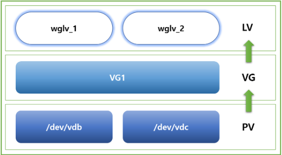
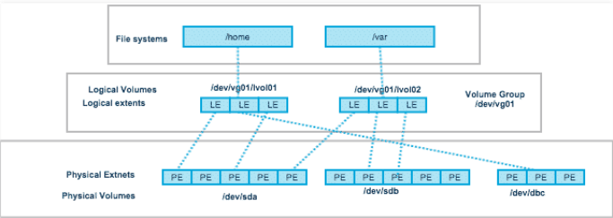

## LVM이란

- LVM(Logical Volume Manager)이란 리눅스의 저장공간을 효율적이고 유연하게 관리하기 위한 커널의 한 부분

## LVM vs 일반 disk partitioning

- LVM이 아닌 기존 방식의 경우, 하드디스크를 파티셔닝한 후 OS 영역에 마운트하여 read/write를 수행했음
- 이 경우 저장공간의 크기가 고정되어 증설과 축소가 어려움
- 이와달리 LVM은 파티션 대신에 volume이라는 단위로 저장장치를 다루는데 이는 스토리지의 확장, 변경에 유연하며 크기를 변경할 때 기존 데이터의 이전이 필요없다

## LVM의 장점

- 유연한 용량 조절
- 크기조절이 가능한 storage pool
- 편의에 따른 장치 이름 지정
- disk striping, mirror volume등을 제공
    - **Disk striping** : 열개의 디스크에 데이터를 분산해 저장하는 기술중 하나
        - 주로 속도 향상이 목적이며 disk striping은 Raid의 구성중 하나로 사용됨
        - 성능 향상, 부하분산, 고장시의 데이터 유실 방지 등 여러 장점이 있지만 Raid 0으로 구성했을시 디스크 고장 시 데이터 손실과 용량 관리의 어려움 등 단점도 있다
    - **Mirror volume** : 데이터의 안전성을 향상시키기 위해 사용되는 논리적인 볼륨
        - 미러 볼륨은 Raid의 구성중 하나로, 데이터를 여러개의 디스크에 중복저장함으로써 데이터의 손실 방지와 데이터의 가용성을 보장하는 기술
        - 미러 볼륨은 Raid 1 구성에서 사용되며 데이터 안정성, 높은 가용성, 간단한 관리 등 여러 장점이 있지만 높은 비용, 용량 비효율성 등 단점도 있는 기술이다
    
    ## LVM 관련 용어 및 구성
    
   
   
    
    ```bash
    물리적 볼륨 / PV (Physical Volume)
    - 실제 디스크 장치를 분할한 파티션된 상태를의미
    - PV는 일정한 크기의 PE들로 구성
    
    물리적 확장 / PE (Physical Extent)
    - PV를 구성하는 일정한 크기의 Block
    - 보통 1PE는 4MB에 해당
    - PE와 LE는 1:1로 대응
    
    볼륨 그룹 / VG (Volume Group)
    - PV들이 모여서 생성되는 단위 (모든걸 합친 거대한 덩어리)
    - 사용자는 VG를 원하는대로 쪼개서 LV로 만들게 됨
    
    논리적 볼륨 / LV (Logical Volume)
    - 사용자가 최종적으로 사용하는 단위로, VG에서 필요한 크기로 할당받아 LV를 생성
    ```