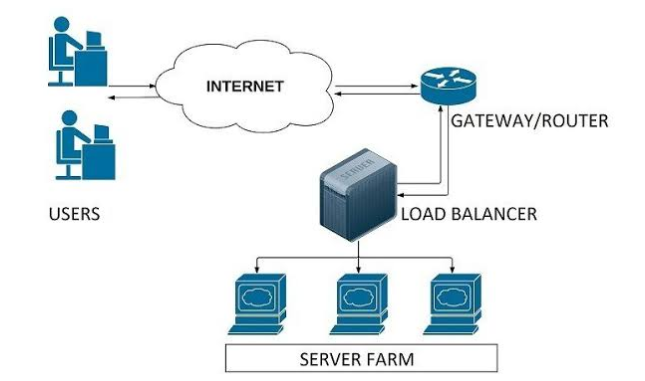

# Load Balancing
## 네트워크의 부하분산 로드밸런싱

## 그리고 로드 밸런서


- 과거와 달리 현대의 네트워크 환경은 폭발적인 IT 기기들의 보급과 기술의 발전에 따라 대규모의 트래픽이 불특정한 시점에 발생 및 집중되는 양상을 보이고 있음
    - 이렇게 많은 접속자를 감당하기 위해 서비스를 제공하는 측에서는 미리 트래픽을 예층하고 서버와 네트워크를 증설해두게 됨
    - `한 서버의 성능을 높이는 스케일업(Scale-up)`작업은 그 한계가 있으므로 `분산 처리를 위해 여러대의 서버들을 놓게되는 스케일아웃(Scale-out)` 작업을 하게 됨
    - 이 때, 여러대의 서버들로 `대규모의 네트워크 트래픽을 분산처리하는 기술을 로드밸런싱(Load Balancing)이라고 함`
    
   
    

## 로드밸런싱 (Load Balancing)이란?

- 로드밸런싱은 `네트워크 또는 서버에 가해지는 부하(Load)를 분산(Balancing)해주는 기술`을 의미
- 로드밸런싱 기술을 제공하는 서비스 또는 장치 (로드 밸런서 | Load Balancer)는 `클라이언트와 네트워크 트래픽이 집중되는 서버들 (Server Pool)또는 네트워크 허브 사이에 위치`
- 특정 서버 또는 네트워크 허브에 부하가 집중되지 않도록 트래픽을 다양한 방법으로 분산하여 `서버나 네트워크 허브들의 성능을 최적인 상태`로 유지할 수 있도록 함

## 로드밸런서의 기본 동작방식

1. 클라이언트의 부라우저에서 [google.com](http://google.com)이라고 입력
2. 클라이언트에 설정된 메인 DNS 서버로 [google.com](http://google.com)의 IP 주소를 문의
3. 메인 DNS 서버는 [google.com](http://google.com) 주소를 관리하는 별도의 DNS 서버에 IP 주소 문의
4. 별도 관리 DNS 서버는 로드밸런서의IP 주소를 메인 DNS 서버에게 알려줌
5. 메인 DNS 서버는 획득한 VIP 주소를 클라이언트에 전송
6. 클라이언트에서 로드밸런서의 VIP 주소로 http 요청
7. 로드밸런서는 별도 로드밸런싱 방법(ex) Round Robin)을 통해 서버에게 요청을 전송
8. 서버의 작업 결과를 받은 로드밸런서는 전달바든 http 결과를 클라이언트에게 전송

## 로드밸런서의 기본 기능

### Health Check

- 기본적으로 보통의 로드밸런서는 서버들(또는 다음 노드)에 대한 주기적인 Health Check를 통해 서버들의 장애 여부를 판단할 수 있음
- 이로 인해 로드밸런서가 있을 때 서버 몇대에 이상이 생기더라도 다른 정상 작동중인 서버로 트래픽을 보내주는 Fail-over가 가능함
- 또한 TCP/UDP 분석이 가능하기 때문에 Firewalldㅢ 역할도 수행할 수 있음

```bash
-L3 체크 : ICMP 를 이용하여 서버의 IP 주소가 통신 가능한 상태인지를 확인합니다.
-L4체크: TCP 는 3 Way-Handshaking (전송-> 확인/전송-> 확인)를 기반으로 통신합니다. 이러한 TCP 의 특성을
바탕으로 각 포트 상태를 체크하는 방식입니다. 예를 들어, HTTP 웹 서버의 경우 80 포트를 사용하므로 TCP 80포
트에 대한 체크를 통해 서버가 살아 있는 상태인지 확인합니다.
- L7 체크 : 어플리케이션 계층에서 체크를 합니다. 즉, 실제 웹 페이지 (예> ... index.html) 에 통신을 시도하여 이상
유무를 파악합니다.
```

### Tunneling

- 로드밸런서는 클라이언트와 서버 간 중간에서 터널링을 제공해줌
- 연결된 상호간에만 캡슐화된 패킷을 구별해 캡슐화를 해제하게 함

### NAT (Network Address Translation)

- 목적지와 수신지의 IP 주소와 TCP/UDP포트를 재기록해 변환하며 네트워크 트래픽을 주고받을 수 있음
- SNAT (Source NAT)
    - 내부에서 외부로 트래픽이 나가는 경우 내부 사설 IP주소를 외부의 공인 IP 주소로 변환하는 방식
    - 집에서 사용하는 공유기가 대표적인 예
- DNAT (Destination NAT)
    - 외부에서 내부로 트래픽이 들어오는 경우, 외부 공인 IP 주소를 내부의 사설 IP 주소로 변환하는 방식
    - 본 포스트에서 설명하고 있는 로드밸런서가 대표적인 예

### DSR (Direct Server Routing)

- 서버에서 클라이언트로 되돌아가는 경우, `목적지를 클라이언트로 설정 후 네트워크 장비나 로드밸런서를 거치지 않고 바로 클라이언트를 찾아가는 방식`
- 로드밸런서의 부하를 줄일 수 있다는 장점이 있음


## 로드밸런싱의 종류와 방법

### L4 로드밸런싱

- L4로드밸런서는 L4 계층에서 동작하는 로드밸런서이므로 네트워크 계층(예> IP) 이나 트랜스포트 계층(예> TCP,UDP) 의 정보를 바탕으로 로드를 분산
    - 즉, IP 주소나 포트번호, MAC주소, 전송 프로토콜 등에 따라 트래픽을 나누고 분산처리 하는 것이 가능
    - 이런 이유로 L4 Load Balancer 를 CLB (Connection Load Balancer) 혹은
    SLB (Session Load Balancer) 라고 부르기도 함

> L4 로드밸런싱에는 다음과 같은 방법들이 있습니다.
> 
- 라운드 로빈(Round Robin) 기반 : 세션을 각 서버에 순차적으로 맺어주는 방식
    - 단순히 순서에 따라 세션을 할당하므로 경우에 따라 경로별로 같은 처리량이 보장이 되지 않음
- 가중치 및 비율 할당 방식 : 서버마다 비율을 설정해 두고 해당 비율 만큼 세션을 맺어주는 방식
    - 특정 서버의 성능이 월등히 뛰어나다면 해당 서버로 세션을 많이 맺어주도록 가중치를 설정하고 나머지 로우급들의 서버들은 적은 세션이 맺어질 수 있도록 가중치를 설정
- 최소 연결 (Least Connection) 기반 : 가장 적은 세션을 가진 서버로 트래픽을 보내는 방식입니다.(가장 많이 사용되는 방식)
- 응답 시간 (Response Time) 기반 : 가장 빠른 응답 시간을 보내는 서버로 트래픽을 우선 보내주는 방식입니다.
    - 각 서버들의 가용한 리소스와 성능, 그리고 처리중인 데이터 양 등이 다를 경우 적합한 방식입니다.
- 해시 (Hash) 기반 : 특정 클라이언트는 특정 서버로만 할당시키는 방식입니다.
    - 예를 들어, 특정 IP 주소 혹은 포트의 클라이언트들은 특정 서버로만 세션이 맺어지도록 함
    - 경로가 보장되며 접속자 수가 많을수록 분산 및 효율이 뛰어남
- 대역폭 (Bandwidth) 기반 : 서버들과의 대역폭을 고려하여 트래픽을 분산 하는 방식

## L7 로드밸런싱

- L7 로드밸런서는 위와 같은 L4 로드밸런서의 기능을 포함하는 것 뿐 만 아니라 OSI 7계층의 프로토콜(예> HTTP,SMTP, FTP 등) 을 바탕으로도 분산 처리가 가능

> L7 로드밸런싱에는 다음과 같은 방법들이 있습니다.
> 
- URL 스위칭 방식 (URL Switching) : 특정 하위 URL 들은 특정 서버로 처리하는 방식
- 컨텍스트 스위칭 방식 (Context Switching) : 클라이언트가 요청한 특정 리소스에 대해 특정 서버 등으로 연결을해줄 수 있음
    - 예를 들어, 이미지 파일에 대해서는 확장자를 참조하여 별도로 구성된 이미지 파일이 있는 서버/스토리지로 직접 연결해줄 수 있음
- 쿠키 지속성 (Persistence with Cookies) : 쿠키 정보를 바탕으로 클라이언트가 연결 했었던 동일한 서버에 계속 할당해주는 방식
- 특히 사설 네트워크에 있던 클라이언트의 IP 주소가 공인 IP 주소로 치환되어 전송 (X-Forwarded-For 헤더에 클라이언트 IP 주소를 별도 기록) 하는 방식을 지원

## 서버관점에서의 로드밸런싱 종류와 방법 - SLB, GSLB

### SLB (Server Load Balancing)

- 서버를 위한 로드밸런싱을 의미하는 용어
- 네트워크허버를 위한 로드밸런싱과는 다른목적과 개념

### GSLB (Global Server Load Balancing)


- GSLB는 DNS을 기반으로 로드밸런싱을 하는 방법
- 예를들어, 같은 동작을 하고 같은 서비스를 제공하는 서버들이 같은 테느워크 혹은 같은 지역 내에 배치되어 있지 않고 여려지역에 분산되어 운용될때 이용하는 방식
- DNS와의 차이점은, GSLB는 아래의 설명들과 같은 요소들을 고려하여 연결대상 서버를 선택하기 때문에 지능형 DNS라고도 이해할 수 있음


## L4/L7 로드밸런서의 주요 성능 지표

- L4/L7로드밸런서의 성능을 가늠할 수 있는 주요한 지표들은 다음과 같음

### 초당 연결 수 (Connections per second)

- 최대 처리 가능한 초당 TCP 세션의 개수

### 동시 연결 수 (Concurrent connections)

- 동시에 최대로 세션을 유지할 수 있는 개수를 의미

### 처리 용량 (Throughput)

- 패킷 자체에 대해 연결이 성립되는 UDP 프로토콜에 대한 로드밸런싱 성능 지표
- FWLB에서는 중요
- 단위는 bps (bit per second)또는 pps(packet per second)를 사용

> 추가로 로드밸런서 또한 만능인 장비가 아니므로 로드밸런서 장비에 장애가 발생할 경우를 대비하여 로드밸런서 자체도 이중화 구성을 할 필요가 있음
>