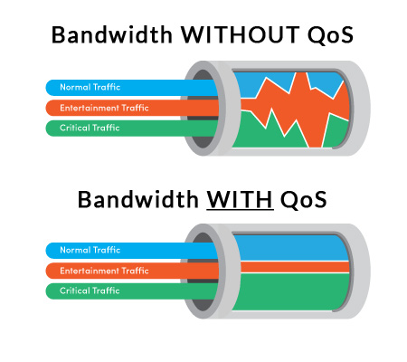

# MPLS
## MPLS란?

- 멀티 프로토콜 라벨 스위칭 (Multi-Protocol Label Switching)
- 데이터 패킷에 IP 주소가 아닌 별도의 라벨을 붙여 스위칭하고 라우팅하는 기술
- MPLS는 20년 넘게 이용되고 있는 기술이며 아직도 많은 기업에서도 MPLS 기술에 의존

## MPLS의 원리

- MPLS은 데이터 포워딩 시스템으로 각 패킷으로 라벨을 할당해줌
- 이러한 라벨은 패킷이 이동하는 방식을 결정해 비공개 네트워크를 형성
- MPLS가 2계층인지 3계층인지에 관해 여러 논쟁이 있지만 패킷이 2계층(노드간 데이터 전송 담당)에서 3계층(패킷 포워딩 및 라우팅 담당)으로 전환되는 사이에 레이블되기 때문에 MPLS를 2.5계층 프로토콜이라 부름

## MPLS의 장단점

### MPLS의 장점

- 높은 전송속도
    - 기존 라우터는 소프트웨어 기반의 라우팅을 하는데 이러한 라우팅은 IP 주소를 기반으로 진행됨
    - 반면 MPLS 네트워크의 경우 패킷이 고정되고 예층가능한 경로로 효율적으로 포워딩되며 매번 IP를 찾아볼 필요가 없음
    - MPLS의 전체적인 라우팅 절차에서 일반적인 라우팅 절차에 비해서 컴퓨팅 자원을 덜 소모하게 됨
    - 실시간 애플리케이션을 실행하는 등 연결속도가 빨라야 할 때 MPLS를 이용하면 좋음
- 높은 전송 품질
    - MPLS에는 Qos 옵션이 있어 패킷이 네트워크에서 이동할 떄 패킷의 성능과 효율성을 개선할 수 있음
    - Qos란
        - Quality of Service
        - 네트워크나 통신 서비스에서 서비스의 품질을 나타내는 개념
        - 데이터 전송 중에 특정 서비스 또는 응용프로그램에 대한 우선순위를 부여해 특정 요구사항을 충족시키는 것을 의미
        - Qos는 네트워크에서 특정 응용프로그램이나 서비스에 필요한 대역폭, 지연, 패킷 손실 및 신뢰성과 같은 특성을 제어하는 방법을 제공
        
        
        
- 원격 연결 가능
    - MPLS는 클라우드 호스팅 네트워크이기 때문에 하드웨어를 추가로 구매하지 않아도 새로운 원격 연결을 추가할 수 있음
- 네트워크 혼잡 감소
    - MPLS는 웹 요청을 다른 라우터로 분할하므로 네트워크 혼잡을 필함
- 작동 시간 개선
    - 다운타임(가동 중지시간)이 발생하는 경우 MPLS는 트래픽을 다른 경로로 전환할 수 있어 작동시간을 개선할 수 있음
- 높은 유연성
    - 유연한 트래픽 엔지니어링이 가능
    - 동일한 대상 주소라고 하더라도 원본 주소에 따라서 패킷 흐름을 다르게 하여 라우팅 할 수 있음
- 실시간 데이터 전송에 유용
    - 연결에 실패하더라도 미리 계산된 백업 경로를 통해 빠르게 재라우팅하기에 실시간 데이터 전송에 유리
- 특정 기반 기술에 의존하지 않음
    - MPLS에서 MP는 멀티 프로토콜을 의미
    - Multi Protocol Label Switching 이라는 이름에서 알 수 있듯이 MPLS는 본래 성능 개선과 간소화를 위해 오버레이 기법으로 설계된 기술
        - 오버레이 기법 : 용량이 큰 프로그램을 분할 가능한 몇개의 부분으로 나눈 뒤, 각 부분의 실행이 필요할 때마다 필요한 부분만 주기억장치로 입력시켜 실행할 수 있게 하는 것

### MPLS의 단점

- 설치하기 어려움
    - MPLS를 이용하려면 라우터에 적용해야하는 설정이 많음
    - MPLS에 대해 잘 알지 못한다면 직접 설치하는 것은 좋지 않은 방법임
- 높은 비용
    - MPLS는 통신사에 돈을 내고 구매해야하는 서비스로 공용 인터넷을 통해 트래픽을 전송하는 것 보다 더 많은 비용이 듬
    - MPLS의 경우 매달 데이터에 대한 비용을 내야 하기 때문에 돈이 많이 나갈 수 있음
    - 인터넷 서비스 공급업체(ISP)에서 전체 MPLS 인프라를 설치해주고 여러분을 대신해서 관리해줄 수 있지만, 이렇게 하면 비용이 더 많이 나감
- 제어권 감소
    - 인터넷 업체에서 여러분을 대신해 네트워크를 설정하기 떄문에 서비스 사용자가 네트워크를 100% 제어할 수 없다
- 낮은 접근성
    - MPLS는 지점 간 연결에 적합하며 SaaS나 클라우드 애플리케이션에는 적합하지 않음
- 느린 배포 속도
    - 회사 사무실이 다른 나라에 있거나 심한경우 다른 대륙에 위치한다면 MPLS를 배포하는데 몇달이 걸릴 수도 있음

## SD-WAN이란?

- Software-Defined Wide-Area Network
- SD-WAN은 엔터프라이즈 네트워크 연결 및 서킷 비용 관리를 위한 자동화된 프로그래밍적 접근 방식
- 비즈니스급 IP VPN, 광대역 인터넷, 무선 서비스로 구성된 SD-WAN을 사용하면 특히 클라우드에서 애플리케이션을 경제적으로 관리할 수 있음

### SD-WAN의 이점

- WAN OpEx 및 CapEx 및 전체 총 소유 비용(TCO) 절감.
- IT 혁신에 발맞출 수 있는 비즈니스 민첩성과 대응력 향상.
- MPLS 네트워크에 의해 부과되는 백홀 페널티를 제거하여 안전한 고성능 멀티연결 지원.
- 연결 간 로드 공유를 허용하고 네트워크 상태에 따라 트래픽 플로우를 조정하여 성능 향상.
- VPN, 방화벽, 보안, WAN 최적화, 애플리케이션 딜리버리 컨트롤과 같은 프리미엄 네트워크 서비스의 자동 프로비저닝 및 변경 지원.
- 제로 터치 프로비저닝(ZTP) 지원
- WAN 트래픽을 암호화하고 네트워크 세그먼테이션을 통해 보안 유출 피해를 최소화하여 네트워크 보안을 향상

## SD-WAN과 MPLS의 차이점

- `SD-WAN은 MPLS와 보다 고급 네트워크이며 MPLS보다 더 안전하고 비용은 더 적게 들면서도 성능도 뛰어남`
- MPLS와 SD-WAN 둘 다 네트워크 연결에 이용되며 재택 근무하는 사용자를 본사 혹은 원격 지점에 연결해주는 데 이용되고 있음
- MPLS와 SD-WAN은 완전히 똑같은 기술은 아니며 각기 다른 용도로 이용될 수 있음
- SD-WAN은 `전송 중립적 오버레이`로 모든 유형의 트래픽을 라우팅할 수 있음
- 또한 SD-WAN은 `중앙 지점에서 기업 WAN 트래픽 설계자가 모든 WAN 기기에 정책을 적용하기가 쉽다는 장점`이 있음
- 반면에 MPLS의 고정된 경로를 프로비저닝하는 데 시간이 꽤 많이 걸리며 고정된 회로가 가동된 이후에는 변경하기도 힘듬
- 하지만 일단 `MPLS 네트워크를 구축하면 뛰어난 실시간 트래픽 전송 성능을 보장할 수 있음`
- 반면에 `SD-WAN은 트래픽을 가장 효율적인 경로로 라우팅하기는 하지만 IP 패킷이 개방된 인터넷에 접근하는 경우에는 뛰어난 전송 성능을 보장할 수 없음`

> 그러므로  MPLS 대신 SD-WAN을 이용하기보다는 SD-WAN과 MPLS는 각기 장단점이 다르므로 상호 보완해주는 방식으로 이용하는 것이 좋음
> 

## MPLS와 VPN 비교

- MPLS와 VPN은 각기 다른 기술이며 서로 다른 목적으로 이용됨
- MPLS는 네트워킹 기술인 반면 VPN은 트래픽을 암호화하고 실제 IP 주소가 유출되지 않도록 해주는 역할을 함
- **VPN**는 컴퓨터 네트워크 위에 계층화된 네트워크인 반면 **MPLS**는 한 네트워크 노드에서 다른 네트워크 노드로 데이터를 전달하는 역할을 함
- **VPN**은 암호화된 터널링 프로토콜을 이용하여 `보안을 강화`하는 반면 MPLS는 데이터 링크 계층(Data Link Layer)과 네트워크 계층(Network Layer) 사이에서 작동할 수 있음
- SD-WAN이 MPLS를 대체하는 것이 아니듯이 MPLS와 VPN은 서로를 대체한다고 보기 어려움
- 각기 다른 용도로 이용되고 장단점이 서로 다르기 때문에 VPN과 MPLS는 상호 보완적인 기술이라고 볼 수 있음