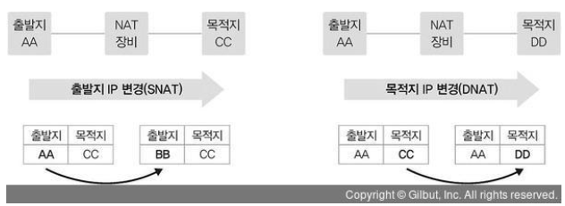

# NAT

## NAT란?

- 네트워크 주소 변환 (Network Address Translation)
- IP 패킷의 TCP/UDP 패킷의 TCP/UDP 포트 숫자와 목적지의 IP 주소등을 재기록 하면서 라우터를 통해 네트워크 트래픽을 주고받는 것

## NAT를 사용하는 이유

1. 사설 네트워크에 속한 여러개의 호스트가 하나의 공인 IP 주소를 사용하여 인터넷에 접속하기 위함
2. 인터넷의 공인 IP 주소를 절약할 수 있음
    1. 인터넷의 공인 IP주소는 한정되어 있기 때문에 가급적 이를 공유할 수 있도록 하는 것이 필요
    2. NAT를 이용하면 사설 IP주소를 사용하면서 이를 공인 IP주소와 상호변환할 수 있도록 함
    3. 공인 IP주소를 다수가 함께 사용할 수 있도록 함으로써 이를 절약할 수 있는 것임
3. 인터넷이란 공공망과 연결되는 사용자들의 고유한 사설망을 침입자들로부터 보호 가능함
    1.  공개된 인터넷과 사설망 사이에 방화벽(Firewall)을 설치하여 외부 공격으로부터 사용자의 통신망을 보호하는 기본적인 수단으로 활용할 수 있음
    2. 이때 외부 통신망 즉 인터넷망과 연결하는 장비인 라우터에 NAT를 설정할 경우 라우터는 자신에게 할당된 공인 IP주소만 외부로 알려지게 하고, 내부에서는 사설 IP주소만 사용하도록 하여 필요시에 이를 서로 변환
    3. 따라서 외부 침입자가 공격하기 위해서는 사설망의 내부 사설 IP주소를 알아야 하기 때문에 공격이 불가능해지므로 내부 네트워크를 보호할 수 있게 됨

## DNAT, SNAT

- SNAT(Source NAT) - 출발지 주소를 변경하는 NAT
- DNAT(Destination NAT) - 도착지 주소를 변경하는 NAT

- SNAT은 사설에서 공인으로 통신할 때 많이 사용
    - SNAT은 사설에서 공인으로 통신할 때 많이 사용됩니다. 사설망의 IP가 요청을 보내면 SNAT을 통해서 공인아이피로 바뀐 후에 공인 아이피의 이름으로 요청을 보내게 됩
- DNAT은 로드밸런서에 많이 사용
    - Virtual IP에 요청을 하면, 로드 밸런서가 내부적으로 내부 IP로 리버스 프록시함