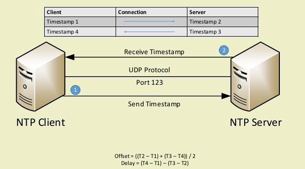
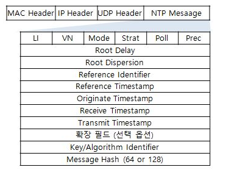
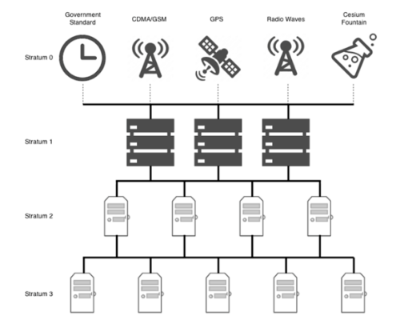
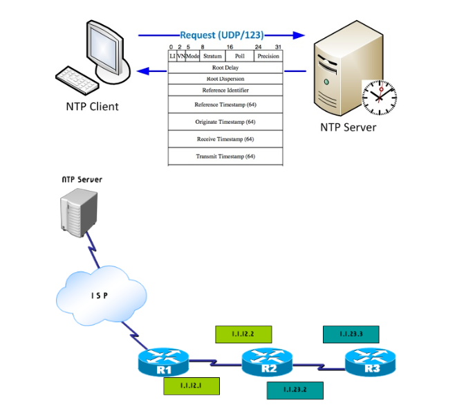
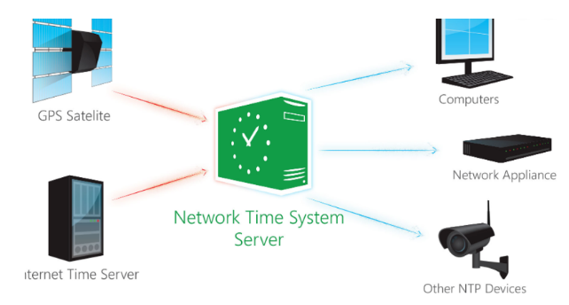

# NTP
- NTP가 무엇인지 공부하기
- NTP 종류 알아보기 (chrony, ntpd..)

---

## NTP

- 네트워크로 연결되어있는 컴퓨터들끼리 클록 시간을 동기화시키는 프로토콜
- 컴퓨터 시간을 설정하는데 있어 필요한 Clock을 최상위 Clock과 동기화하여 여러대의 PC에서도 최상위 Clock을 기반으로 시간을 결정
- PC에 있는 Local시간이 아닌 Online을 통해서 시간을 받아오는 것

- 따라서 여러대의 PC 혹은 디바이스의 시간을 인터넷상으로 동기화하여 모든 장비의 시간을 똑같이 만들어주는 통신이라고 볼 수 있음
- NTP의 경우는 최소 0.001초 단위까지 동기화가 가능
- UTP 기반으로 이루어짐
- 서버에서 브로드캐스팅 방식으로 시간의 정복다 전달이 되며, 이를 호스트가 받아서 시간을 설정
- 서버와 클라이언트의 계층을 표현하기 위해서 NTP는 Stratum이라는 용어를 사용함

- 일반적으로 Stratum 구조는 Treeㄱ ㅜ조로 이루어짐
- 가장 최상위의 서버를 Stratum 0으로 표현함
- 한국에서는 [time.kriss.re.kr](http://time.kriss.re.kr) , [ntp.postch.ac.kr](http://ntp.postch.ac.kr)와 같은 Stratum 1 버전이 존재하며, 대개 클라이언트는 Stratum 2,3,4 에 접속해 시간을 받아오게 됨

---

## NTP 통신의 장점

- 데이터의 손실을 방지함
- 로그에 대한 분석이 용이함
- 예약된 작업을 정상적으로 가능하게 한다

## NTP 통신의 단점

- 외부 서버를 통해서 시간을 동기화하는 부분으로 인해 보안상 취약하다
- 이를 해결하기 위해 별도의 Time Server을 이용할 수 있다

## NTP 표준 방식 표준

- RFC 5905: Network Time Protocol Version 4: Protocol and Algorithms Specification
- RFC 5906: Network Time Protocol Version 4: Autokey Specification
- RFC 5907: Definitions of Managed Objects for Network Time Protocol Version 4 (NTPv4)
- RFC 5908: Network Time Protocol (NTP) Server Option for DHCPv6

