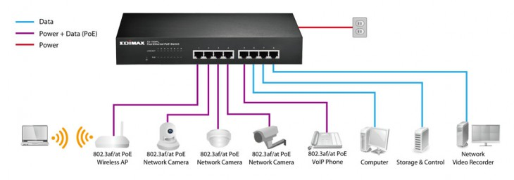

# POE

## POE란

- PoE는 "Power Over Ethernet" 의 줄임말로 기존의 랜 케이블 (RJ45, UTP)에 추가적인 전원을 공급하여 허브에 연결된 각종 기기를 별도의 추가 전원 입력이 필요 없이 구동가능하게 만든 일종의 규격
- PoE (Power Over Ethernet)는 이를 지원하는 네트워크 허브 혹은 연결되는 기기들의 전원부(어댑터등)를 따로 연결하지 않고 Ethernet Cable(UTP)을 통해 데이터와 전원을 동시에 보낼 수 있는 기술

## POE를 사용하는 이유

- PoE를 지원하는 장비들이 하나의 랜 케이블을 통해 전원을 공급받으므로 해당 기기에 별도의 전선 및 전원 공급장치도 필요하지 않게 됨
- USP 연결 장비 및 콘센트 연결 장비 감소로 설치가 원활
- 허브 단에서 전원 과부하, 저부하, 쇼트 시 전원이 자동 차단
- PoE를 지원하지 않는 장비에는 별도의 스프리터 및 인젝터 통해 사용이 가능하긴

## POE의 단점

- 기존의 스위칭 허브(PoE미지원)환경에서 PoE 시스템으로 전환할 경우 PoE 스위치로 교체하거나 Mid-Span 장비(허브와 장비 중간에 놓여 전원을 함께 공급하는 장치)를 추가해야하므로 초기 투자비용이 듬
- 케이블의 특성으로 인해 최대 100m 까지만 사용이 가능
- 직류 48V 전원 공급 만이 가능하므로 ip 카메라, ip 전화기, 무선 AP (엑세스 포인트) 등의 소형 기기에는 사용이 가능하지만 소비전력이 비교적 높은 데스크탑 PC등 일반적인 장치에는 사용이 힘듬
- PoE 의 표준은 만들어진지 상당히 오래된 규격이지만 이를 적용한 제품들이 아직까지는 생각보다는 많지 않다

## 주요 PoE 스위치 유형

### **비관리형 POE 스위치**

- 해당 유형은 주로 가정 또는 I.T. 팀이 없고 보유 컴퓨터가 5~10대인 소규모 비즈니스에서 사용하고 있음
- 플러그 앤 플레이 방식으로 사용이 간편할 뿐만 아니라 가격이 적당한 편
- 수정 또는 관리가 불가능하며 보안 기능은 없음
- 보안 옵션이 많이 필요하므로 민감한 데이터를 처리하는 경우에 사용하는 옵션이 아

### **스마트 또는 하이브리드 POE 스위치**

- 해당 스위치는 인터넷을 통해 액세스하며 포트와 가상 네트워크 등을 구성
- 관리형 스위치 대비 간단하고 가격이 저렴하나, 동일한 여러 기능을 제공하지는 않습니다
- 단, 보안 기능은 지원
- 이 유형의 스위치는 VoIP, 소규모 네트워크, VLAN에 사용하게 됩니다.

### **관리형 POE 스위치**

- 비용이 가장 비싼 최고급 유형의 스위치
- 높은 수준의 제어, 관리 및 완벽한 보안 수준을 자랑
- 24시간 모니터링, 원격 액세스, 제어, 확장성을 필요로 하는 경우, 해당 스위치가 적합