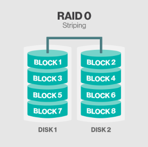
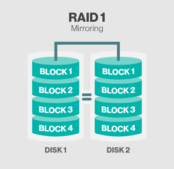
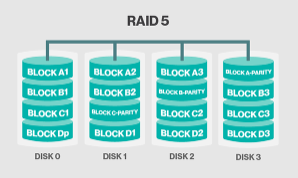

## Raid Level (Redundant Array of Inexpensive(Independent) Disk)

- **Raid**는 여러 디스크를 묶어서 그룹으로 만들어 하나의 논리적인 디스크처럼 사용하는 기술
- 논리적 디스크를 LU(Local Unit)이라고 함

## Raid의 효과

### 안정성 확보

- HDD에 장애가 발생해도 데이터가 유실되지 않도록 데이터 기록을 이중화함

### 성능 향상

- Raid에서는 Raid 컨트롤러가 미리 정해놓은 길이로 I/O를 분할해 복수의 HDD에 대해 병렬로 I/O 처리를 한다
    - 이 고정 길이를 Raid의 스트라이프 크기라고 부름

### 용량의 확장

- 논리 HDD는 물리적 한계(용량)를 넘어서 자유롭게 용량을 결정할 수 있다

---

## Raid의 Level

- Raid의 레벨에는 0, 1, 2, 3, 4, 5, 6, 10 등 여러가지 종류가 있지만 여기서는 간단히 0, 1, 5만 보고 넘어가자

## Raid 0

- 스트라이핑 (분산 저장 방식)
- 동일한 디스크 여러대를 병령 방식으로 구성

### 빠른 성능

- 데이터를 사용할 때 I/O 성능이 향상된다

### 낮은 안정성

- 디스크의 수가 증가할수록 디스크 수가 증가하기 떄문에 만약 **한개의 디스크라도 문제**가 발생할 경우 **전체 Raid가 깨지는 문제**가 발생할 수 있음
- 디스크에 오류가 발생하였을때 미러링 및 장애 내구성을 제공하기 위한 오버헤드도 존재하지 않기 때문에 **오류를 복구할 수 없음**

## Raid 1

- 미러링 (디스크 이중화)
- 모든 디스크에 데이터를 N개로 복제하여 각 디스크에 저장

### 높은 안정성

- Raid level 중 가장 안정성이 높음  (높은 장애 내구성)

### 높은 비용

- 디스크의 공간이 2배가 필요하므로 비용이 드는 **비용문제**가 있음
- 미러링으로 빠른 평균 읽기 전송률을 보여주지만, 평균 쓰기 전송률은 느릴수 밖에 없음

## Raid 5

- 블록단위로 구성된 스트라이핑
- Raid 5는 모든 드라이브에 Parity 정보를 분산저장
    - Parity : 디스크 장애 시 데이터를 재구축하는데 사용할 수 있는 사전에 계산된 값
        - 디스크 4개중 3개는 데이터 저장용으로 사용하고 나머지 하나는 Parity 영역으로 사용
        - 디스크 하나가 장애가 날 경우 Parity 영역을 이용해 장애가 난 디스크의 데이터를 복구
- 문제가 발생할 경우 컨트롤러가 정상적으로 운영되고 있는 다른 디스크로부터 손실된 데이터를 가져와 복구, 재생함