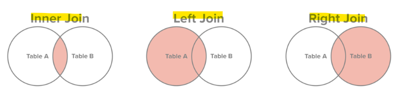

# SQL Service
- 기초적인 SQL 문법 공부하기. 과제에 사용되는 문법 보고 이해할 수 있을 만큼만

---

## SQL이란?

- 구조적 쿼리 언어(SQL)은 관계형 데이터베이스에 정보를 저장하고 처리하기 위한 프로그래밍 언어
- 관계형 데이터베이스는 정보를 표 형식으로 저장
- SQL 문을 사용해 데이터베이스에서 정보를 저장, 업데이트, 제거, 검색 및 검색이 가능
- 데이터베이스 성능을 유지 관리하고 최적화하는데 사용할 수 있음

## SQL의 문법

### DML(Data Manipulation Language)

- insert
- update
- delete
- select

### DDL(Data Definition Language)

- create
- alter
- drop
- truncate
- rename

### DCL(Data Control Language)

- grant
- revoke

### TCL(Transaction Control Language)

- commit
- rollback
- savepoint

---

### Create

- 테이블 생성

```sql
create table student(
칼럼명 타입 조건(not null 등),
칼럼명 타입 조건(not null 등),
칼럼명 타입 조건(not null 등),
PRIMARY KEY ~~ );
```

### Insert

- 테이블에 데이터 삽입

```sql
insert into student values(테이블에 맞는 데이터 양식);
```

### Update

- 데이터 내용 수정

```sql
update 테이블 set 칼럼 = '값' where 조건;
```

### Delete

- 데이터 삭제

```sql
delete from 테이블 where 조건;
```

### Select

```sql
//모든 컬럼 조회
select * from student;
//필요한 컬럼 조회
select age, name from student;
```

### Select 문법 순서

1. Select
2. from
3. where
4. group by
5. having
6. order by

**쿼리의 실행 순서는 from → where → group by → having → select → order by**

---

### Where

```sql
//컬럼 조회의 조건
select * from student where id = 1;
//and or 조건
select * from student where sex='남자' and(or) address='서울'
//like 조건 | %로 표현
select * from student where name = '김%';
```

### Limit

```sql
//조회 결과 행의 수 제한
select * from student limit 1;
```

---

### Group By

```sql
//특정 칼럼 기준의 데이터 그룹핑
select age from student group by age;
```

### Order by

```sql
//특정 칼럼 기준으로 정렬
//ACS: 오름차순 1 2 3 4 5
//DESC: 내림차순 5 4 3 2 1 
select * from student order by age desc;
```

### Distinct

```sql
//중복 행을 제거
select distinct name from student;
```

### Alias

```sql
//칼럼에 별칭을 주고 조회
select age '나이' from student where id = 3;
```

---

### 연산자

```sql
//산술 연산자
+ - / *
//비교 연산자
> < >= <= = != ^= <>
//논리 연산자
and or not
//비교 연산자 2
between and  in is null like
```

---

## 함수

### 문자 조작 함수

- UPPER(str) : 대문자 변환
- LOWER(str) : 소문자 변환
- INITCAP(str) : 첫 글자만 대문자 변환
- CONCAT(str, tmp) : 두 문자값 결합
- SUBSTR(str,a,b) : 문자 추출 a = 시작위치, b = 개수
- LENGTH(str) : 문자열 길이 반환
- L/RPAD(대상,총길이,채울문자열) : 대상 문자열에 채울문자열을 총길이만큼 채워서 반환*LPAD('001',7,'0') ▶ 0000001*
- LTRIM, RTRIM(대상, 제거할 문자열) : 대상 문자열에서 제거할 문자열을 없앤 뒤 반환*select LTRIM('00010' , '00') ▶ 010*
- REPLACE(대상문자열,바꾸고싶은대상,바꾸고싶은내용) : 대상문자열에서 바꾸고 싶은 대상을 바꾸고 싶은 내용으로 수정한 뒤 반환*REPLACE('ABCDEFG','DEF','XXX') ▶ ABCXXXG*

---

### 계산 함수

- max
- min
- count
- avg
- sum

```sql
select 계산함수(칼럼)from 테이블; //이러한 형식으로 사용
```

---

## JOIN



### Inner Join

```sql
//일반적인 Join A와 B 테이블의 조인에서 A와 B 테이블 모두에 있는 레코드만 조회
select A.a, A.b, B.c
from A
Join B
On B.a = A.c;
//ON 대신 WHERE를 사용할 수 있다
```

### Left Outer Join

```sql
//A와 B 테이블의 join 상황에서 A 테이블 기준으로 B 테이블에 A테이블의 칼럼과 일치하는 조건이 없으면 B테이블의 칼럼은 null로 조회됨
select A.a, A.b, B.c
from A
Left Outer Join B
On B.a = A.c;
//outer를 생략할 수 있다
```

### Right Outer Join

```sql
//A와 B 테이블의 조인 상황에서 B테이블 기준으로 A테이블에 B테이블의 칼럼과 일치하는 조건이 없으면 A테이블의 칼럼은 NULL로 조회됨
select A.a, A.b, B.c
from A
Right Outer Join B
ON B.a = A.c;
//역시 Outer을 생략할 수 있다
```

### Cross Join (Cartesian Join)

집합의 곱 개념으로

A= {a, b, c, d} , B = {1, 2, 3} 일 때

A CROSS JOIN B 는

(a,1), (a, 2), (a,3), (b,1), (b,2), (b,3), (c, 1), (c,2), (c,3), (d, 1), (d, 2), (d,3)의 결과가 된다.

결과의 개수는 n(A) * n(B) 이다.

```sql
SELECT A.a A.b B.c
FROM A
CROSS JOIN B;
// 위 아래 쿼리의 결과는 같다.
SELECT A.a, A.b, B.c
FROM A, B;
```

---

[코딩테스트 SQL 모음집](https://velog.io/@ekfvnddl99/프로그래머스-SQL-총정리)