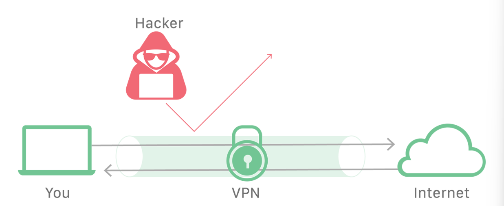
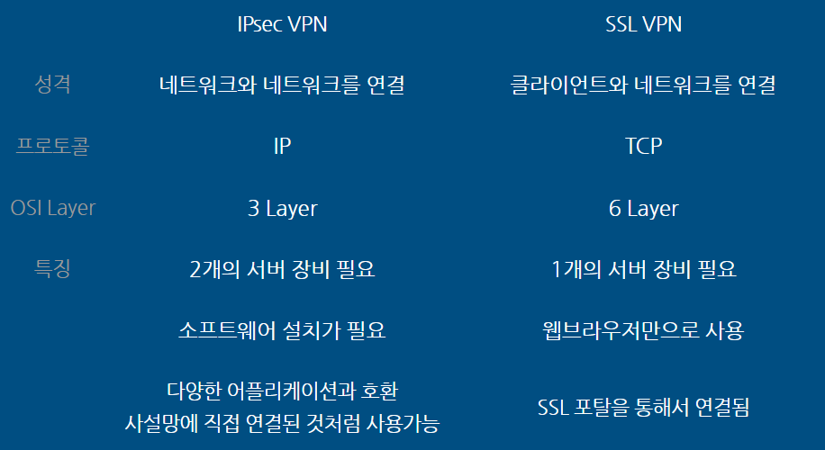
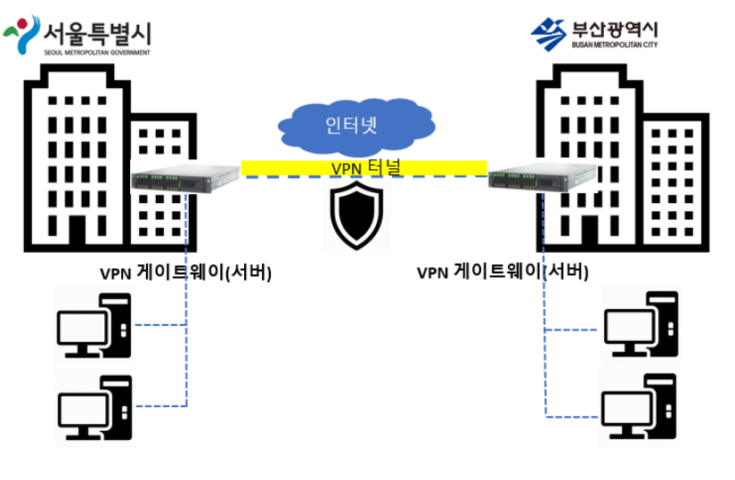
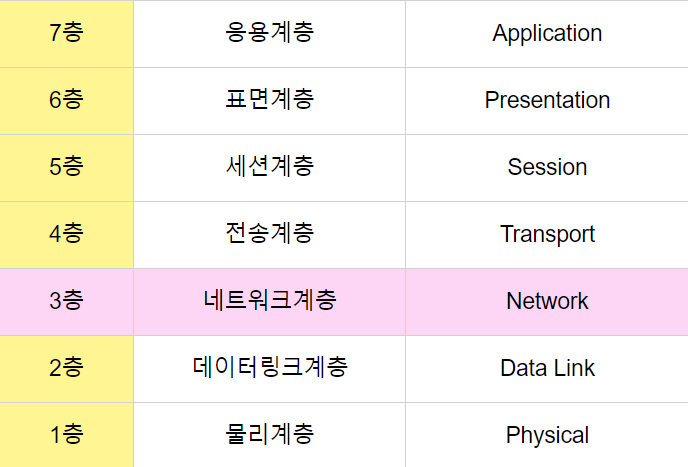
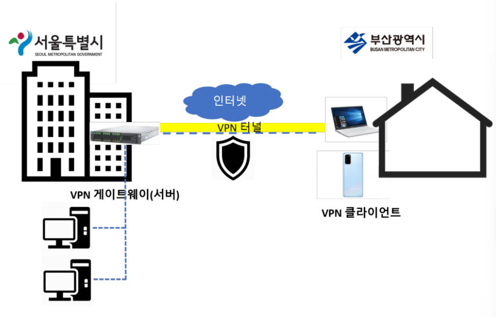
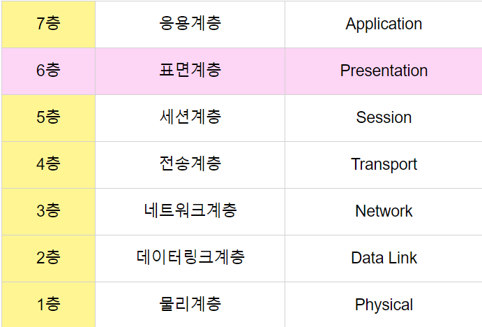
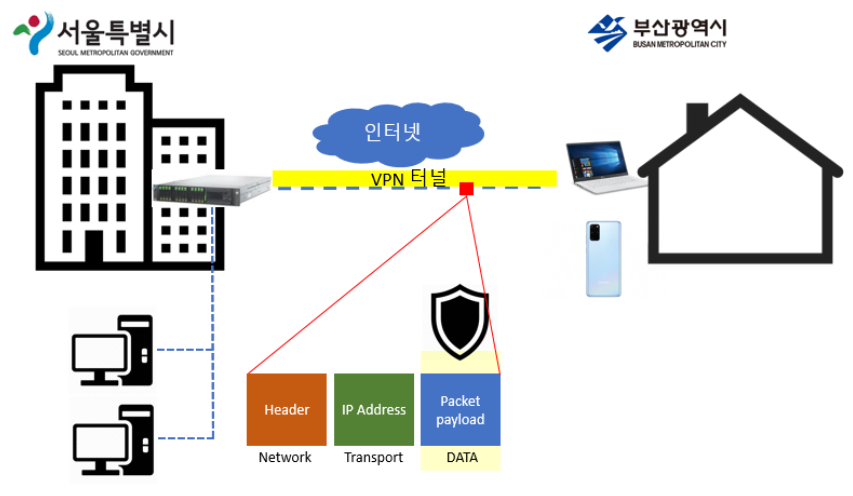
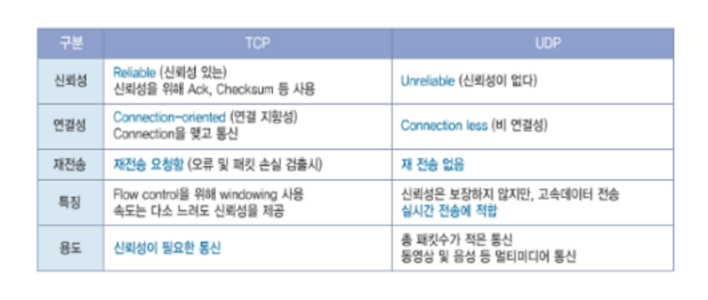

# VPN
# VPN

- VPN이 무엇인지 공부하기.
- VPN 종류 공부하기 (해당 과제에서는 IKev2 S2S VPN을 사용하기 때문에 그 기술 주로 보기)

[VPN이란? | Cloudflare](https://www.cloudflare.com/ko-kr/learning/access-management/what-is-a-vpn/)

---

## VPN이란?

- 사용자가 사설망에 연결된 것처럼 인터넷에 엑세스 할수 있도록 하는 인터넷 보안 서비스
- 인터넷 통신을 암호화할 뿐만 아니라 강력한 익명성 제공
- VPN을 이용하는 가장 일반적인 이유 중 일부는 공용 WiFi에서 스누핑을 방지하거나, 인터넷 검열을 우회하거나, 원격 작업을 위해 기업 내부 네트워크에 연결하는 것

## VPN의 작동 방식

- 일반적으로 대부분의 인터넷 트래픽은 암호화되지 않으며 매우 공개적
- 사용자가 인터넷에 연결할 때 사용자의 장치는 ISP에 연결이 되는데, 사용자에 대한 정보는 웹 사이트 요청의 모든 단계에서 유출됨
- 사용자의 IP 주소는 프로세스 전반에 걸쳐 노출되므로 ISP 및 기타 중개자는 사용자의 검색 습관에 대한 로그를 유지할 수 있음
- 사용자의 장치와 웹 서버 간에 전송되는 데이터는 암호화되지 않
    1. VPN 클라이언트는 암호화된 연결을 사용해 ISP에 연결
    2. ISP는 VPN클라이언트를 VPN 서버에 연결해 암호화된 연결을 유지
    3. VPN 서버는 사용자 장치의 데이터를 해독한 다음 인터넷에 연결하여 암호화되지 않은 통신으로 웹 서버에 엑세스
    4. VPN 서버는 VPN 터널이라고도 불리는, 클라이언트와의 암호화된 연결을 생성함

---

## VPN의 종류

### IPsec VPN

- IPsec VPN은 `VPN 게이트웨이(서버) 장비를 2개`를 서로 연결함으로서 네트워크와 네트워크를 연결하는 VPN

- OSI 7계층 중 3계층인 네트워크 계층에서 동작(IP 프로토콜 사용)

- 이것은 IPsec VPN 터널을 통해 이동하는 패킷은 아래아래처럼 패킷이 가진 `헤더, IP주소, 데이터 부분이 모두 암호화` 처리되어 전달된다는 것
- 대신 IPsec VPN에서 추가한 헤더와 IP 주소로 데이터가 전달됨

---

### SSL VPN

- SSL VPN은 `VPN 게이트웨이(서버) 장비 1개와 VPN 클라이언트`를 인터넷 `웹브라우저`를 통해 연결하는 VPN
- VPN 장비가 하나만 있으면 되기 떄문에 IPsec VPN에 비해 저비용

- OSI 7계층 중 6계층인 표면 계층에서 동작 (TCP 프로토콜 사용)

- OSI 7계층중 6계층에서 동작한다는 것은 아래처럼 SSL VPN 터널을 통해 이동하는 패킷은 `데이터 부분만 암호화` 처리되어 전달된다는 뜻
- 나머지 부분은 일반적인 TCP 프로토콜을 통해 통신하는 데이터처럼 통신이 됨

- SSL VPN은 UDP를 지원하지 않기 때문에 사용가능한 어플리케이션이 제한적
- 반면 IPsec는 TCP, UDP를 모두 지원

---

## ikev2 VPN이란

- IPsec 기반 터널링 프로토콜인 Internet Key Exchange Version 2는 Cisco와 Microsoft에 의해 개발됨
- 이 프로토콜은 Linux 및 다양한 플랫폼과 호환이 가능하며, Blackberry 장치도 지원
- Blackberry?
    - 블랙베리은 2002년에 캐나다의 블랙베리가 개발한 스마트폰
    - 미국과 유럽의 비즈니스맨을 중심으로 널리 사용되고 있으며, 세계적으로 130개국 이상 1,900만명 이상이 사용하고 있음
    
  
    
- Microsoft Corporation의 VPN 연결은 인터넷 연결이 일시적으로 끊어졌을 때 자동을 VPN연결을 재설정하는데 뛰어남

> 장점
> 
- 안전성 : 3DES, AES, AES 256등 다양한 암호 지원
- Blackberry 장치 지원
- 연결이 끊어지거나 네트워크 전환 후 다시 연결할 때 안정적
- 최소한 사용자 측에서 쉽게 설정 가능
- • L2TP, PPTP 및 SSTP보다 상대적으로 빠름

> 단점
> 
- 제한된 플랫폼에서 지원됨
- SSTP또는 OpenVPN과 같은 SSL 기반 솔루션과 비교할 때 사용되는 UDP 500번 포트가 쉽게 차단됨
- 오픈소스 구현이 아님
- 서버측에서 IKEv2를 구현하는 것이 까다로우며 이로인해 몇몇 잠재적인 문제가 발생할 수 있음
