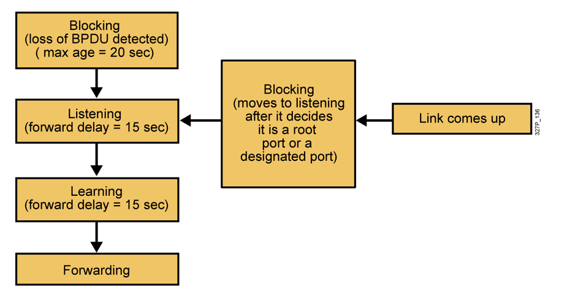

# 기능반 06-25 강의

## Switch

> 전송방식
> 
1. Store and Forward
- Frame을 전부 확인하고 다음 처리를 시작하는 방식
- 목적지 주소, 출발지 주소, 에러 발생여부를 확인하고 처리
- error가 발생하면 Frame을 버리고 재전송을 요구(error) 복구능력이 좋다
- 다른 방식에 비해 느리다

1. Cut-through
- 수신되는 Frame의 목적지 주소만 본 다음 바로 전송을 하는 방식
- 처음 6byte 만 보고 전송하기 때문에 속도가 빠름
- 에러 복구 능력에는 약점을 가진다

1. Fragment-Free
- 위의 두가지 방식을 결합한 방식
- 처음 64byte를 보고 전송하는 방식
- Store and Forward보다 빠르고 Cut-through보다는 에러감지 능력이 뛰어나다

---

## Transparent Bridging

- Ethernet Switch가 Frame을 수신하여 목적지로 전송하는 방식과 절차를 정의
- 즉 Switch가 수신한 Ethernet Frame을 참조하여 MAC address table을 생성 및 갱신하고 목적지로 전송할 때 사용하는 Protocol이 Transparent Bridging
- Learning, Flooding, Forwarding, Filtering, Aging 과정이 모두 합쳐져 Transparent bridging기능을 수행
- Routing table은 관리자가 생성하지만 MAC address는 Switch가 자동 생성

## Spanning-Tree protocol

- 다중화로 구성된 스위치에서 Looping 발생을 방지하기 위해 하나의 경로를 제외하고 나머지 경로들을 차단했다가 이상이 발생했을 경우 차단됬던 경로를 사용하는 알고리즘

## BPDU

- Switch는 서로 BPDU를 교환해서 BPDU의 내용을 바탕을 Looping 없는 논리적인 경로를 구성

> 동작방식
> 
1. 전체 Switch중에 ROot 스위치 하나를 선택
2. Root 스위치가 아닌 다른 스위치들은 Root 포트를 하나씩 선택
3. 한 Switch의 segment마다 Designated(지정) 포트를 하나씩 선택.
4. Root 포트와 Designated 포트가 아닌 포트는 alternate 포트로 선택되고 Block 상태를 유지

> Blocking(20sec) → listening(15sec) → Learning(15sec) → Forwarding
> 
- 보완한 기술
    1. Ether channel: 여러개의 Link가 하나의 링크처럼 동작하게 하는 기술(최대 8개)
    2. Uplink fast: Link 복구 시간을 1분에서 약 2~3초 안에 가능하도록 만든 기술
    3. RSTP, MSTP 등의 기술을 사용해도 Convergence 시간을 단축할 수 있음

---

> BPDU 종류
> 
1. Congiguration BPDU
- Switch는 Configuration Bpdu를 이용하여 Root switch를 선출하고 각 Switch port의 역할을 지정

1. TCN BPDU
- Switch가 연결된 Link에 변화가 생겼을 때 이것을 Root Switch에 알리기 위해 사용

---

## VLAN

- VLAN을 이용하면 Network의 보안성 강화
- VLAN을 사용하면 Switch Network에서 Load balancing이 가능
- VLAN은 서로 번호(ID)로 구분
- 사용 가능한 VLAN 번호는 1~4094

## Trunk Port

- 하나의 Port에 여러개의 VLAN Frame 이 흘러다닐 수 있도록 하는 경우
- 다수의 같은 VLAN이 여러개의 Switch에 존재할 경우  trunk port 를 통해 각 Switch에 연결된 같은 VLAN에 속한 장비끼리 서로 통신이 가능

> Trunking이란 여러개의 VLAN을 실어나르는 것
> 
- Switch 에 다수의 VLAN이 존재할 경우 각 VLAN 별로 각각의 Link를 만들어주어야 하지만 그럴경우 너무 많은 Link가 필요하기 떄문에 하나의 Link에 여러개의 VLAN이 흘러다닐수 있도록 Trunking을 구성
- 이러한 Trunking에는 ISL과 IEEE802.1Q 방식이 있음
1. ISL (Inter Switch Link)
- Cisco 전용으로 Cisco 장비간에만 사용하는 방식
- native VLAN 사용불가
1. IEEE802.Q
- Trunking에 대한 표준 프로토콜
- Native VLAN 사용가능

## CDP - Cisco Discovery Protocol

- CDP는 Layer 2 Protocol
- Cisco 전용 프로토콜로 인접한 이웃장비에 대한 정보를 얻는데 사용