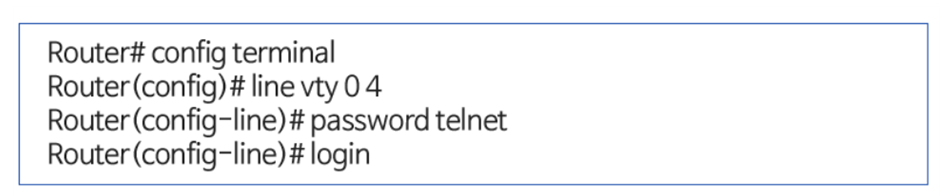
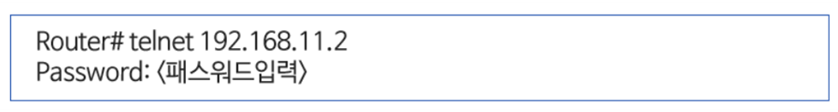
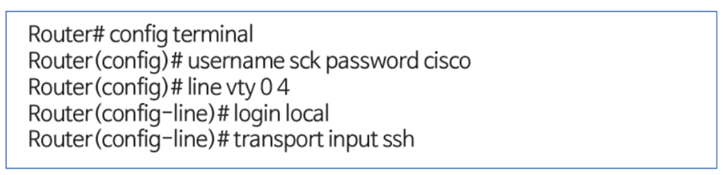
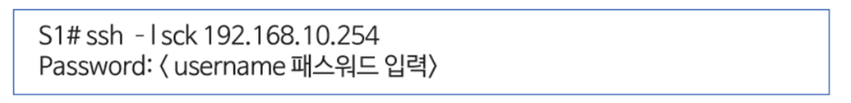

# CDP, LLDP

## CDP(Cisco discovery protocol)

- 인접하고 있는 L2, L3 스위치와 라우터의 주요 정보들을 탐색할 수 있는 프로토콜
- 주기적으로 인접한 장비 같에 CDP 패킷을 전달하고 수집/
시스코 장비 같에만 동작하는 프로토콜
- CDP 패킷: 60초 주기로 이웃 장비로 광고하며 180초(holdtime) 동안 이웃장비로부터 수신되지 않으면 이웃 장비 인터페이스에 문제가 있는 것으로 판단
- CDP에는 장비의 주요 정보 포함 (command - show cdp neighbors)
    - 장비 식별자(Device identifers) - 장비에 설정된 이름과 도메인 이름
    - 주소 리스트(Address List) - IP 주소와 2계층 주소
    - 포트 식별자(Port identifier) - 연결된 인터페이스 정보
    - 역량 리스트(Capabilities list) - 장비의 수행 능령 별 분류(Router, Switch)
    - 플랫폼(Platform) - 장비의 하드웨어 모델

## LLDP(Link Layer Discovery Protocol)

- LLDP는 CDP의 기능을 국제 표준화한 프로토콜
- 802.1AB에서 LLDP를 정의하고 있으며 모든 제조사 장비간에 주요 정보들을 탐색할 수 있는 프로토콜
- LLDP패킷을 송신 또는 수신만 할 수 있도록 설정 가능

## TELNET(Terminal Network)

- Telnet은 응용 계층 프로토콜로 원격지에서 라우터나 스위치로 접속할 때 사용
- 가상 터미널(VT, Virtual Terminal) 서비스라고도 하며, 포트(port)번호를 23번을 사용하여 원격 로그인 지원
- 텔넷으로 원격지에서 접속할 수 있도록 라우터나 스위치에는 패스워드를 지정한 가상 터미널이 설정되어 있어야 함

- command words
    - 가상 터미널 설정 명령어
        
      
        
    - 원격접속 telnet 명령어
    
    

---

## SSH (Secure Shell)

- 텔넷(Telnet)은 원격 접속 시 암호화하지 않은 평문 형식으로 데이터가 전달되므로 보안에 취약한 단점이 있음
- SSH는 보안 기능이 강화된 원격 접속 프로토콜로 프트번호 22를 사용하는 원격 로그인 서비스 제공
- 텔넷과 달리 공유 패스워드를 사용하지 않고도 사용자 인증을 위한 별도의 사용자 이름과 패스워드가 요구됨
- 패킷 암호화를 위해 보안 키 정보가 필요함
- comand words
    - SSH 사용자 인증 명령어
        
    
        
    - 원격접속 SSH 명령어
    