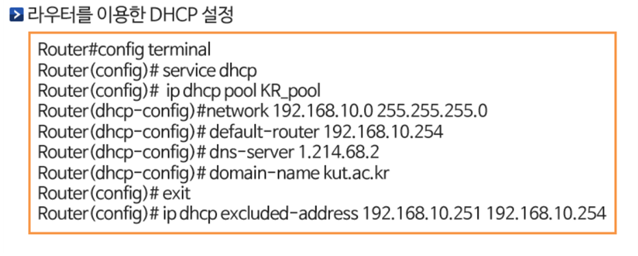
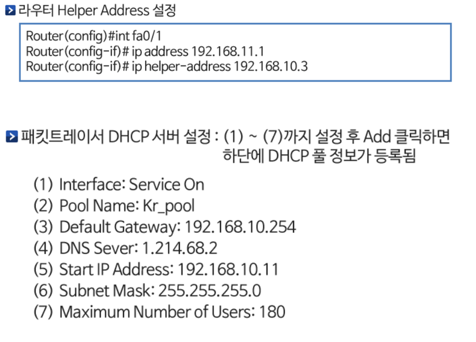

# DHCP

## DHCP 개요

- 인터넷을 사용하기 위해 IP주소를 자동으로 구성되도록 설정된 클라이언트가 IP주소의 목록을 관리하고있는 서버에게 IP 주소를 대여하는 과정에서 사용하는 프로토콜
- 오늘날 대부분의 개인 컴퓨터에서 사용 / DHPC는 주어진 IP주소가 일정한 시간 동안만 그 컴퓨터에 유효하도록 하는 임대 개념
- 동적(dynamic)할당 : 네트워크 관리자는 DHCP 서버에 네트워크 환경 정보를 지정해 각 PC의 요청이 들어오면 자동으로 응답
- DHCP 동작 절차

