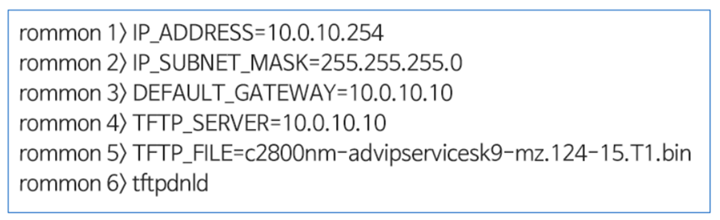
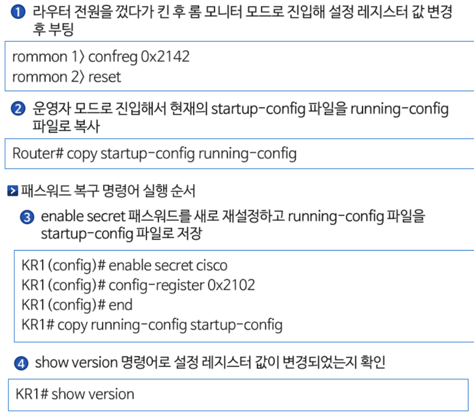

# Network Backup, **recovery procedure**

## IOS (Internetwork Operating System)

- 시스코 라우터와 스위치의 운영체제이며 플래시 메모리에 저장
- IOS 파일 손상 또는 플래시 메모리 문제로 인해 시스템에 장애가 발생할 수 있기 때문에 IOS 파일의 백업이 필요함
- IOS 백업과 복구는 내부 망에 설치된 TFTP(Trivial File Transfer Protocol) 서버를 통해 이루어짐
- command word
    - 백업 명령어 - copy flash tftp
    - 업그레이드 명령어 - copy tftp flash
    - 설정 파일 백업 명령어 - copy running-config tftp

> 롬 모니터 IOS 복구 명령어
> 

---

## Password recovery procedure

- 스위치의 enable secret 패스워드를 잊어버렸을 경우 운영자 모드로 들어갈 수 없음
- 패스워드를 복구하기 위해서는 기존 패스워드를 무시하는 복구 절차가 필요함
- 라우터나 스위치의 부팅 절차에서 NVRAM에 있는 startup-config 파일을 running-config 파일로 복사하면서 기존에 설정되어있는 패스워드를 물어보기 때문에 부팅 시 startup-config 파일을 로딩하지 못하도록 하는 것이 중요함
- 부팅 시 startup-config 파일을 로딩하지 못하도록 하는 것이 중요함
- 부팅 시 startup-config 파일 로딩 절차를 무시하도록 설정 레지스터 (config-register)의 값을 변경해야 함 (0x2102 → 0x2142)

- password recover command
