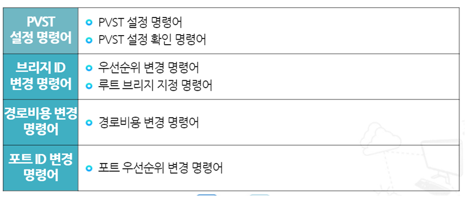

# PVST (Per VLAN Spanning Tree)

## CST (Common Spanning tree)

- 스위치 네트워크의 토폴로지와 루트 브리지의 위치에 따라 통신이 비효율적으로 이루어질 수 있음
- 차단된 대체 포트를 사용하지 못해 이중화의 목적 중 하나인 속도 향상이 되지 않음

## PVST (Per-VLAN Spanning Tree)

- VLAN 당 Spannig tree를 별도로 관리하는 기술
- 스위치 네트워크에는 여러 VLAN이 있을 수 있으며, 모든 VLAN이 오직 하나의 스패닝 트리 만을 공통으로 사용한다면 통신이 비효율적으로 이루어질 수 있음
- VLAN 단위로 각각 별도의 스패닝 트리가 존재한다면, 각 VLAN에 적합한 토폴로지로 스위치 네트워크를 구성할 수 있어서 통신 효율이 개선됨
- PVST를 이용하면 부하분산을 통해 이중화의 목적 중 하나인 속도 개선(속도 향상)을 이룰 수 있음

---

## Bridge ID를 이용한 VLAN 부하분산

- 브리지 ID는 루트 브리지와 루트 포트를 선정할 때 제일 우선하는 요소
- 브리지 ID를 변경하여 루트 브리지와 루트 포트 변경 가능
- VLAN에 대한 우선순위를 0으로 지정하면 해당 스위치가 루트 브리지가 됨

## 스위치 링크의 경로비용을 이용한 VLAN 부하분산

- 스위치 링크의 경로비용은 루트 포트와 지정 포트를 선정할 때 사용되는 요소
- 경로비용은 각 스위치에서 직접 변경 가능
- 변경하고자 하는 포트의 경로비용을 지정해서 루트 포트 변경 가능

## 포트 ID를 이용한 VLAN 부하분산

- 포트 ID를 이용한 VLAN 부하분산
- 포트 ID는 루트 포트와 지정 포트를 선정할 때 사용되는 요소
- 포트 ID는 연결된 상대편 스위치에서 변경
- 포트 ID를 변경하기 위해서는 포트 우선순위 변경
