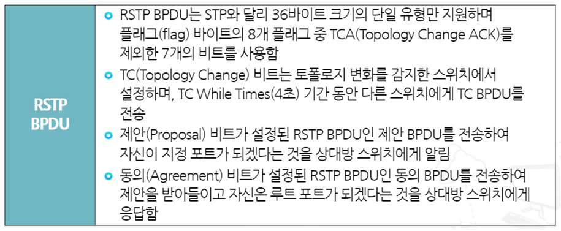
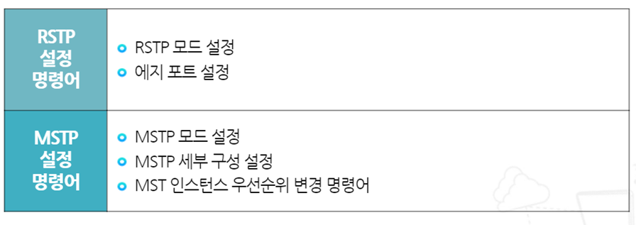

# RSTP (Rapid STP), MSTP (Multiple STP)

## RSTP 특징

- RSTP에서는 제안(Proposal) BPDU와 동의(agreement) BPDU를 주고 받으면서 포트 유형을 결정하고 포트 상태를 전송상태로 변경함
- 브리지 ID가 작은 스위치에서 내 포트가 지정 포트임을 알리는 제안 BPDU를 상대방 스위치에게 전송하고 이를 수신한 스위치는 자신이 루트 포트가 되겠다는
동의 BPDU를 전송함
- STP에서는 30~50초 걸려서 전송 상태로 바뀌는 반면에 RSTP는 바로 전송 상태로 변경됨

## RSTP 포트 역할

- 루트 포트: STP의 루트 포트와 동일
- 지정 포트: STP의 지정 포트와 동일
- 대체 포트: STP의 대체(비지정) 포트와 동일
- 백업(Backup) 포트: 지정 포트의 백업용 포트로 허브와 연결할 때 생성
- 비활성(Disabled) 포트: Shutdown 되어있는 포트

---

## MSTP 특징

- MSTP는 데이터의 흐름이 같은 VLAN들을 묶어서 부하분산의 장점을 살리고 스패닝 트리의 개수를 줄여서 스위치의 부하를 감소시킴
- 동일한 흐름의 VLAN을 묶어서 하나의 그룹을 만들 수 있는데 이를 인스턴스(Instance)라고 하며, 인스턴스 별로 스패닝 트리가 만들어짐
- 스위치 네트워크에 1~20번까지 20개의 VLAN이 있다면 인스턴스 1은 1~10, 인스턴스 2는 11~20으로 묶어서 망 내에 2개의 스패닝 트리만 잇도록 함
