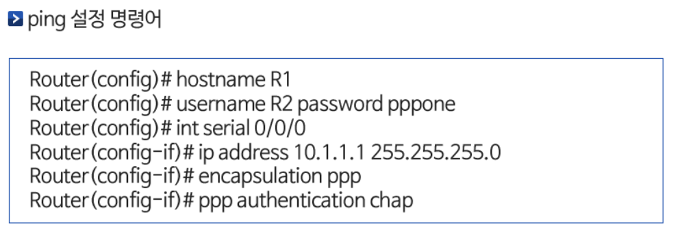

# WAN building using HDLC

## point-to-point WAN

- LAN과 LAN을 연결하기 위해 전용회선을 이용한 WAN으로 HDLC와 PPP 프로토콜을 사용

## switched WAN

- WAN 스위치로 구성된 교환망을 이용하여 여러지점의 LAN을 상호 연결하는 WAN으로 프레임 릴레이, MPLS 프로토콜 등을 사용

## HDLC

- HDLC 특징
    - HDLC는 국제 표준 프로토콜로 컴퓨터와 컴퓨터가 직접 연결된 통신 환경에서 사용되는 OSI-7 계층 모델의 2계층, 즉, 데이터 링크 계층 프로토콜
    - HDLC는 주로 전용회선으로 연결된 WAN에서 사용되며, 오류제어와 흐름제어를 통하여 신뢰성있는 데이터 전송을 보장
    - 시스코(Cisco)에서는 HDLC를 약간 변형시켜서 자사의 라우터 간의 연결에 사용하고 있으며, 라우터 간 시리얼 연결 시 적용되는 기본 프로토콜을 HDLC로 지정
- HDLC 프레임
    - 시작과 끝을 알려주는 8비트 플래그(flag), 주소 필드, 데이터의 신뢰성 전송을 담당하는 제어필드, 오류 검출을 위한 FCS 필드로 구성
    - 이더넷(Ethernet)의 주소 필드는 목적지와 송신지 MAC 주소로 이루어져 있으나 HDLC는 한개의 주소 필드로 목적지와 송신지를 식별 가능
    
    > 시스코 HDLC 프레임 - 표준 HDLC를 사용하는 라우터와 시스코 라우터 간에는 통신이 안되는 문제가 있음
    > 
    - command words
        - HDLC 설정 명령어 - encapsulation hdlc
        - 동기화 클럭 신호 발생 명령어 - clock rate 2000000

## PPP를 이용한 WAN 구성

> PPP - HDLC와 함께 전용회선으로 연결된 환경에서 사용하는 2계층 프로토콜
> 
- 내부적으로 LCP(Link Control Protocol) 계층과 NCP(Network Control Protocol)계층 2개의 계층으로 구성
- LCP, NCP, PAP, CHAP
    - LCP - 연결되는 양 시스템 간의 데이터 링크를 설정, 유지, 협상과 해제 담당
    - IP 등 상위 계층 프로토콜과의 인터페이스를 협상하고 이들의 연결을 유지
    - 인증 프로토콜로 PAP(Password Authentication Protocol)와 CHAP(Challenge Handshake Authentication) 지원
    - PPP 프레임은 HDLC 프레임과 유사한 구조를 가지고 있으며 시스코 HDLC 프레임처럼 데이터 필드 앞에 상위 계층 프로토콜을 식별하는 프로토콜 (protocol) 필드를 가지고 있음
    - PPP 동작 절차는 3단계로 이루어지며 연결단계 → 인증단계 → 네트워크 계층 프로토콜 단게를 거침
    
    