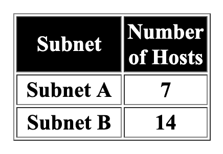

# Solution 1-3-2
1. 로컬 LAN 토폴로지를 구성

    

해당 조건에 부합한 ip 주소 체계 설정

1. network를 연결
2. R1 설정
- 이름: Router1
- 암호: class
- console, vty line 암호 : cisco
- interface addresses, descriptions
    - fa0/0 text: connection to host1
    - fa0/1 text: connection to switch1
1. ping 명령어로 연결 확인
2. 결과확인 
- 완수 시 100% 여야 함
- 그래도 안되면 버젼 차이이므로 포기( 현재 버젼에 호환되지 않는 기능이거나 삭제됬을 수 있음)