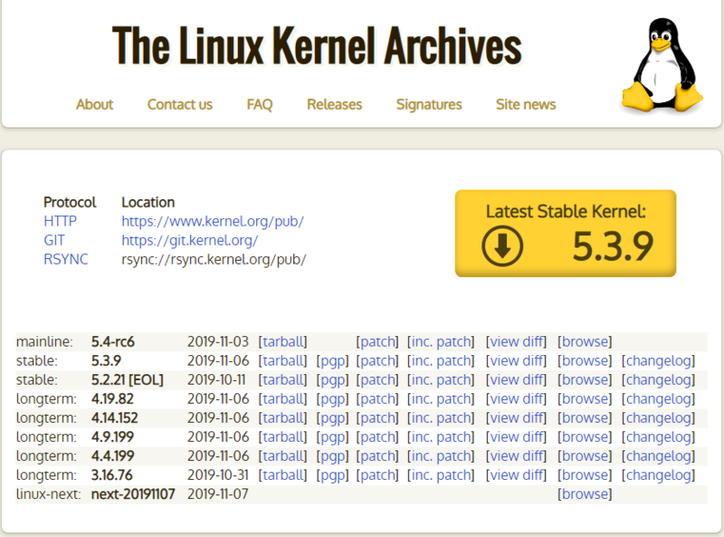

# 2.1 리눅스의 탄생

## 리눅스의 탄생

- 리눅스는 리누스 토르발스가 만든 커널에 컴파일러, 쉘, 기타 응용 프로그램들이 조합된 배포판
- 이러한 배포판은 여러가지 응용프로그램을 조합해 많은 리눅스 단체 또는 회사가 자신의 이름을 붙여서 판매한다 (Ubuntu Linux)
- 리눅스는 GNU 프로젝트에 의해 완성되었으므로, 정확히는 GNU/Linux 라고 부르는게 맞다

## 커널

- 커널(kernel)에는 현재 제어하는 하드웨어 장치의 지원 여부 정보, 하드웨어 성능, 하드에어를 제어하는 코드들이 들어있다
- 리누스 토스발스는 이 ‘커널’이라고 부르는 리눅스의 핵심을 개발하였고 지금도 업그레이드중이다
- 리눅스 커널의 변천사는 다음 표와 같다

    

- 리눅스 커널의 버전은 안정버전(Stable Version)과 개발 버전(Development Version)으로 나눠서 배포됨
- 안정버전은 이미 검증된 개발 완료 코드로 구성되어 있으며, 개발 버전은 현재 개발 중인 버전으로 상대정으로 불안정함
- 리눅스의 가장 큰 장점은 배포판에 포함된 기본 커널을 사용자가 직접 최신의 커널로 업그레이드 할 수 있다는 것이다 | 커널 업그레이드(커널 컴파일)