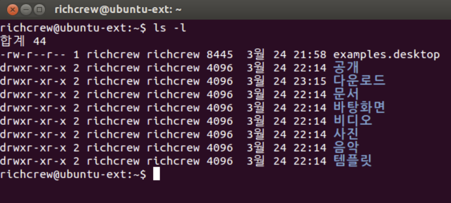

# Basic Commands

# 1. ls (List Segments)

- 현재 위치의 파일 목록을 조회하는 명령어

  

```jsx
ls option  |  ls - [option]

- ls -a : .을 포함한 모든 파일과 디렉토리 표시
- ls -l : 지정한 디렉토리의 내용을 자세히 출력
- ls -d : 지정된 디렉토리의 정보를 출력
- ls -R : 하위경로와 그 안에 있는 모든파일을 같이 출력
```

# 2. cd (Change Directory)

- 디렉토리를 이동하는 명령어

```jsx
cd option 

- cd [Directory Path] : 지정한 디렉토리 경로로 이동
- cd ~ : Home Directory로 이동
- cd / : 최상위 루트 디렉토리로 이동
- cd . : 현재 디렉토리
- cd .. : 상위 디렉토리로 이동
- cd - : 이전 경로로 이동
```

# 3. touch

- 0 Byte의 빈 파일을 생성하는 명령어. 존재하지 않을 때 생성하는 명령어

```jsx
touch의 옵션들
- touch [File Name] : filename의 파일을 생성. 확장자 상관없음.
- touch -c filname : filename의 시간을 현재시간으로 갱신
- touch -t [YYYYMMDDhhmm] : 시간을 수동으로 갱신
```

# 4. mkdir (Make Directory)

- 디렉토리를 생성하는 명령어

```jsx
mkdir의 옵션
- mkdir [Dir Name] : Dir Name이라는 디렉터리를 생성
- mkdir dir1 dir2 : 한번에 여러개의 디렉터리 생성
- mkdir dirname/subdir -p : -p 옵션을 사용하면 하위 디렉토리까지 같이 생성함.
- mkdir -m [permission number] dir : 특정 권한을 갖는 디렉터리 생성
```

# 5. cp (Copy)

- 파일을 복사하는 명령어
- 이때 복사한 곳의 내용은 그대로 남아있다
- cp 명령어는 Backup 용도로 유용하게 쓰일 수 있다

```jsx
cp의 옵션
- cp file1 file2 : file1을 file2라는 이름으로 복사
- cp -f file1 file : 강제 복사 (file2라는 파일이 이미 있을 때 안에 내용을 지우고 복사함)
- cp -r dir1 dir2 : 디렉터리를 복사하는것이다. 하위 경로와 파일들을 전부 복사한다
```

# 6. mv (Move)

- 파일을 이동시키는 명령어이다.
이때 이동을 한 원본 경로의 내용은 삭제된다
mv의 옵션

```jsx
- mv file1 file2 : file1을 file2로 변경
- mv file1 /dir : file1 파일을 /dir 디렉터리로 이동
- mv file1 file2 file3 /dir : 여러 파일을 dir 디렉터리로 이동
- mv /dir1 /dir2 : dir1 디렉터리를 dir2 디렉터리로 변경
```

# 7. rm (Remove)

- 파일을 삭제하는 명령어

```jsx
rm의 옵션
- rm file1 : file1이라는 파일을 삭제
- rm -f file1 : file1이라는 파일을 강제로 삭제
- rm -r dir : dir이라는 디렉터리 삭제. 디렉터리를 삭제할 때에는 -r 옵션 필수
```

# 8. Cat (Catenate)

- 파일의 내용을 출력
- Redirection 기호를 활용해 새로운 파일을 생성하는 것도 가능
- 주로 Log를 확인할 때 사용

```jsx
cat의 옵션
- cat file1 : file1의 내용을 화면에 출력한다.
- cat file1 file2 : file1과 file2의 내용을 출력한다.
- cat file1 file2 | more : 페이지별로 출력
- cat file1 file2 | head : file1과 file2의 내용중 처음부터 1~10 줄만 출력
- cat file1 file2 | tail : file1과 file2의 내용중 끝부터 1~10 줄만 출력
```

# 9. Rediretion (<, <<)

- ‘>’기호 : 기존에 있는 파일 내용을 지우고 저장
- ‘>>’기호 : 기존 파일 내용 아래에 덧붙여서 저장
- ‘<’기호 : 파일의 출력 결과나 데이터를 입력

```jsx
Redirction Example
- cat file1 file2 > file3 : file1과 file2의 내용을 합쳐서 file3에 저장
- cat file4 >> file3 : file3 아래 file4의 내용을 덧붙여서 저장
- cat < file1 : file1의 결과를 출력
- cat < file1 > file2 : file1의 출력 결과를 file2에 저장
```

# 10. echo

- 출력 명령어

```jsx
Echo의 예시
- echo $0 - 현재 세션 확인
- echo $(((3+1)*4)) - 이렇게 사칙연산도 가능
- echo "123123" > 123.txt - 123123이 123.txt라는 파일에 저장됨
- echo "(My name is HJ)" - 특수문자를 사용할 때 큰 따옴표를 사
Echo의 옵션
echo -n : 메세지 출력후 기본 줄 안바꿈
echo -e,-E : \가 붙을떄 사용
echo -a : 명령어가 실행될 때 삑!! 소리남, 쓸모없음
```

# 11. alias

- 자주 사용하는 명령어들을 변수처럼 사용

```jsx
alias 예시
- alias 123 = ls : 이렇게 설정하면 123을 입력해도 ls가 실행되는거랑 같음
```