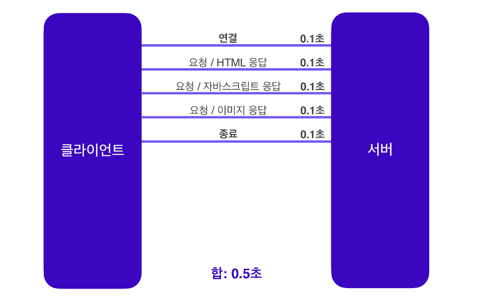
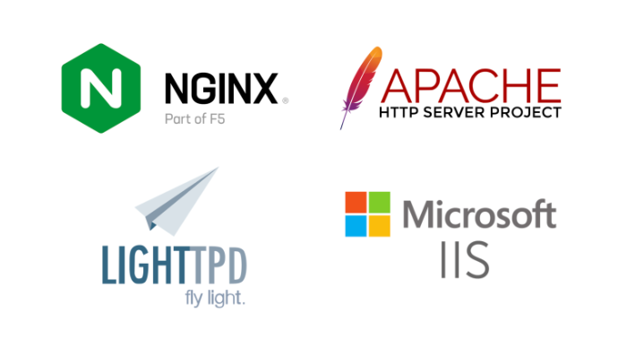

# Web Service
- 자체적인 Web Service (HTTP, HTTPS)는 난이도 하에 속함
- proxy 공부하기(Forward Proxy, Reverse Proxy, Transparent Proxy)
- Proxy 공부하면서 Nginx 공부하기. 사용법 등

---

# HTTP

- HTTP (Hypertext Transfer Protocol)은 웹 상에서 데이터를 주고받기 위한 프로토콜
- 웹에서 html을 불러오기위한 프로토콜
- 클라이언트(Web browser)와 서버간의 데이터 전송을 위한 규약을 제공함
- 클라이언트가 서버에 **요청**을 보내면, 서버가 요청에 대한 **응답**을 보내는 **클라이언트-서버 구조**로 이루어져있다.

# HTTP의 특징

## Stateless(무상태) 프로토콜

- **Stateless(무상태)**: 각 요청은  서버에 저장된 상태와 독립적임
    - 장점: 서버 확장성이 높다 | 무상태는 응답 서버를 쉽게 바꿀 수 있기 때문에 무한한 서버 증설이 가능하다
    - 단점: 클라이언트가 추가데이터를 전송해야한다
- 무상태(Stateless)의 한계
    - 로그인과 같이 유저의 상태를 유지해야하는 서비스라면, **브라우저 쿠키, 서버 세션, 토큰** 등을 이용해 상태를 유지해야한다.

## Connectionless(비연결성) 프로토콜

- **Connectionless(무연결성):** 클라이언트가 서버에 요청을 보내면 서버는 응답을 보내고 연결을 종료합니다. 각각의 요청은 독립적으로 처리됨.

### **Connection Oriented(연결을 유지하는 모델)**

- TCP/IP는 기본적으로 연결을 유지한다
- 연결을 유지하는 모델에서는 클라이언트가 요청을 보내지 않더라도 연결을 유지해야함
- 이 경우 연결을 유지하는 서버의 자원이 계속 소모됨

### **Connectionless(연결을 유지하지 않는 모델)**

- 비연결성을 가지는 HTTP에서는 실제로 요청을 주고받을 때만 연결을 유지하고 **응답을 주고나면 TCP/IP 연결을 끊는다**
- 이를 통해 최소한의 자원으로 서버를 유지할 수 있다.

## HTTP의 비연결성

- HTTP 1.0을 기준으로, HTTP는 기본적으로 **연결을 유지하지 않는 모델**이다
    - 일반적으로 초 단위 이하의 빠른 속도로 응답한다
    - 1시간동안 수천명이 서비스를 사용해도 실제 서버에서는 처리하는 요청은 수십개 이하로 매우 작음(웹 브라우저에서 연속해서 검색 버튼을 누르지 않기 때문)
- 비연결성의 특징은 트래픽이 많지않고, 빠른 응답을 제공할 수 있는 경우 효율적으로 작동
- 하지만 트래픽이 많고, 큰 규모의 서비스를 운영할 때 비연결성은 한계를 보인다

## HTTP 1.0 - 비연결성의 한계

- TCP/IP 연결을 새로 맺어야 하므로 3way handshake 시간이 추가됨
- 웹 브라우저로 사이트를 요청하면 HTML, CSS, JavaScript, 추가 이미지 등 수많은 자원이 함께 다운로드되는데, 이러한 자원들을 각각 보낼 때마다 연결을 끊고 다시 연결하고를 반복하는 것은 매우 비효율적이다.

- HTTP 1.0 에서는 **각각의 자원을 다운로드하기 위해 연결과 종료를 반복** 해야 했다.
- 연결 ~ 종료까지가 새로운 TCP/IP 연결이다.

> HTTP 1.1에서 **HTTP 지속연결(Persistant Connections)**이 가능해지며, 위의 문제들이 해결됨
> 

## HTTP 1.1 - 지속연결

- HTTP 지속 연결에서는 연결이 이루어지고 난 뒤 각각의 자원들을 요청하고, **모든자원에 대한 응답이 돌아온 후에 연결을 종료**한다.
- 이밖에도 파이프라이닝, 멀티플렉싱 등 다양한 연결 방식이 있다

---

- 기본 HTTP 지식
- HTTP이란 ? (어떻게 동작하는가 ? -> 3-way handshaking 기반 동작)
- HTTPS란 ? (어떻게 동작하는가 ? -> TLS Handshaking)
- URL에 [www.google.com을](http://www.google.xn--com-of0o/) 입력하였을 때의 패킷의 동작 과정
- HTTP Version별 공부 (0.9 1.0 1.1 1.2 2.0 3.0 )
- HTTP Authentication 방식 (Session 인증, Cookie 인증, Token 인증)
- CORS란 ?
- JWT (Json Web Token) 란 무엇인가 ?
- HTTP MEssage의 구조 (Request message, Response Message )
- HTTP Method : GET POST 등등
- HTTP Status Code : 200,300 등등

---

## Forward Proxy

- 클라이언트가 외부 서버에 직접 연결하는 대신 프록시 서버를 통해 연결
- 클라이언트의 요청을 대신하여 외부서버로 전달하고, 외부 서버의 응답을 콜라이언트에게 중계
- 주로 보안, 캐싱, 로깅, 액세스 제어를 위해 사용

### 용도

- 익명성 보장: 클라이언트의 IP 주소를 숨기고 익명성을 제공
- 캐싱: 외부 서버로의 반복적인 요청을 감소시키기 위해 응답을 캐싱해 성능을 향상시킴
- 보안: 외부서버와 직접 통신하는 것을 막고 프록시를 통해 트래픽을 필터링하여 보안을 강화

### 작동 방식

1. 클라이언트는 외부 서버에 직접 연결하는 대신 포워드 프록시에 연결
2. 포워드 프록시는 클라이언트의 요청을 받아 외부 서버로 중계
3. 외부 서버는 응답을 포워드 프록시에 보내고, 포워드 프록시는 이를 클라이언트에게 전달함

## Reverse Proxy

- 클라이언트가 Reverse Proxy에 요청을 보내면, Reverse Proxy는 이 요청을 여러 서버 중 하나로 중계하여 서버의 응답을 클라이언트에게 전달
- 주로 로드 밸런싱, 보안, 성능 최적화를 위해 사용된다

### 용도

- 로드 밸런싱: 여러 서버에 트래픽을 분산시켜 서버 부하를 분산
- 보안: 클라이언트와 실제 서버 간의 직접적인 통신을 막아 보안을 강화
- 성능 최적화: 정적 콘텐츠를 캐싱하고 동적 콘텐츠는 서버에 요청하여 성능을 최적화함

### 작동방식

1. 클라이언트는 리버스 프록시에 요청을 보냄
2. 리버스 프록시는 이 요청을 여러 서버 중 하나로 중계하여 해당 서버에 대한 요청을 전달
3. 서버는 응답을 리버스 프록시에게 보내고, 리버스 프록시는 클라이언트에게 응답을 전달

## Transparent Proxy

- 클라이언트가 프록시를 사용하는지 감지되지 않도록 설계된 프록시 서버
- 네트워크 트래픽을 모니터링하거나 필터링하는 데 사용됨

### 용도

- 네트워크 트래픽 관리: 트래픽을 모니터링하거나 필터링하여 보안 정책을 시행
- 사용자 액세스 제어: 특정 웹 사이트에 대한 액세스를 제어하고 제한

### 작동방식

- 클라이언트는 프록시 서버를 명시적으로 설정하지 않고도 투명 프록시를 통해 통신
- 클라이언트는 프록시 서버의 존재를 인식하지 못하게

---

## Nginx

- 높은 성능과 안정성 그리고 현재 가장 많이 사용되고 있는 웹 서버
- Apache 같은 웹 서버와 비교하면 더 빠르고, 가볍고, 대규모 애플리케이션 처리에 적합하다는 장점이 있음

### Client

- Client란 서비스를 이용하기 위해 네트워크를  통해 요청을 보내는 주체를 말함
- 인터넷에서 웹 페이지를 보기위해 웹 ㅂ라우저를 실행하면 웹 브라우저가 클라이언트가 됨
- 웹 개발 영역에서 보통 클라이언트라고 하면, Chrome, Safari, Edge등 브라우저를 의미한다고 생각하면 됨

### Web Server

- 웹 서버는 클라이언트의 요청에 따라 HTML, CSS, JS, Image 파일과 같은 정적 파일을 응답하여 제공하는 소프트웨어를 뜻함
- 웹 서버는 HTTP 프로토콜을 사용하여 클라이언트와 통신
- 대표적인 웹 서버로는 Hginx, Apache 등이 있음
- 그 외에도 Microsoft IIS, Lighttpd 등 다양한 웹 서버가 존재함

### WAS

- WAS는 클라이언트 요청에 대해 동적인 처리를 하는 영역
- 웹 서버와 달리 애플리케이션 로직을 실행할 수 있도록 구성
- 예를들어 회원가입이나 로그인 등의 로직을 처리하는 영역이 WAS 임 (데이터베이스 연동, 트랜잭션 관리 등  기능도 제공)
- 이를 통해 웹 애플리케이션의 안정성과 성능을 향상시키며, 개발자들은 애플리케이션 개발에 집중할 수 있음

### DB

- DB는 조직이나 개인이 필요한 정보를 체계적으로 저장, 관리, 검색할 수 있는 시스템
- DB는 일반적으로 다수의 사용자가 공유할 수 있으며, 대규모 데이터의 저장과 검색을 처리할 수 있음

> 보통 웹 서비스는 클라이언트 → 웹 서버 → WAS → DB 순으로 요청이 되고 역순으로 응답한다
>