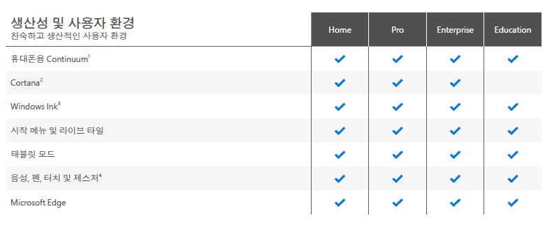

# Windows 에디션 별 차이
Windows의 다양한 에디션은 각각 다른 기능과 특징을 가지고 있습니다. 이를 통해 사용자들은 자신의 용도와 요구 사항에 맞는 Windows 버전을 선택할 수 있습니다.

---

## Windows Home

- 개인 사용자를 위한 기능을 제공
- 이 버전은 사용자들이 일상적인 작업을 수행하고 인터넷을 사용하는 데 필요한 기능을 제공

## Windows Pro

- 비즈니스 환경에서 사용되는 버전
- 추가적인 기능과 보안 옵션을 제공
- 이 버전은 업무 관련 작업을 수행하는데 필요한 기능들을 포함
- 예를 들어, 도메인 가입, 원격 데스크톱 연결, 비트로커와 같은 보안 기능 등이 있습니다.

## Windows Enterprise

- 대규모 조직이나 기업에서 사용되는 버전
- 보안 및 관리 기능이 강화
- 이 버전은 조직 내에서 보안 정책을 관리하고 더욱 안전한 작업 환경을 제공하는데 초점을 두고 있음

## Windows Education

- 학교나 교육 기관에서 사용되는 버전으로 교육용 기능과 도구를 제공
- 이 버전은 학생들과 교사들이 교육과 관련된 작업을 수행하는데 필요한 기능들을 포함
- 예를 들어, 멀티미디어 학습 도구, 가상화 기능, 그룹 정책 관리 등이 있음

## Windows Pro for Workstations

- 고성능 작업 환경을 위한 버전
- 이 버전은 대용량 데이터 처리 및 고성능 애플리케이션 실행에 최적화되어 있음
- 이를 통해 사용자들은 더욱 효율적인 작업을 수행 가능

---

## 윈도우10 에디션 별 차이

---

- Home 에디션과 Pro 에디션을 구분하면 대부분의 기능이 없는것처럼 보일수 있지만 실제로 쓸때  느낄만한 것은 거의 없다
    - Pro를 골라야하는 경우는 Hyper-V를 사용할 때나 기업체에서 사용하는 여러 추가기능이 필요할때 Pro를 선택한다
- Enterprise 에디션은 당연히 모든 윈도우 기능이 풀려있으며 가장비쌈
- Education 에디션은 대학생들에게 무료로 윈도우를 배포해주는 것인데 (인증받은 학교들에 한해서) 학교 이메일이 있다면 받을 수 있다 | 한번 등록하면 못 옮김