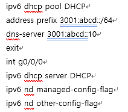

# 지방 4과제 제주
## Etherchannel 서비스

> Gig1/0/8-9
> 
- 채널 1 할당
- active 모드

> Gig 1/0/10-11
> 
- 채널 2 할당
- active 모드

> Gig 1/0/12-13
> 
- 채널 3 할당
- active 모드

---

DHCP 서비스

> 각 장치는 ip 할당 후 진행
> 

> 모든 default-router은 각대역의 a.a.a.254 대역 사
> 
- HQ-R1과 BR-R1의 dns-server 주소는 192.168.10.10 으로 같다
- Public-R1은 dns-server의 주소는 100.100.100.1이다
- ISP2는 ipv6 주소가 쓰인다

---

## HSRP 서비스

> HSRP 설정
> 
1. 라우터를 추가하고 인터페이스를 추가한 후, 각각의 인터페이스에 IP 주소를 할당합니다.
2. HSRP 그룹 번호를 설정하고, 가상 IP 주소를 할당합니다.
3. HSRP 그룹에서 active와 standby 역할을 할 라우터를 선택합니다.

> commands
> 
- HSRP 그룹 번호 설정: `standby group-number`
- 가상 IP 주소 할당: `standby ip virtual-ip-address`
- Active 우선 순위 설정: `standby priority priority-value`
- Active/Standby 우선 순위 변경: `standby preempt [delay [minimum] [reload]]`
- HSRP 인터페이스 설정: `standby [group-number] ip [ip-address [secondary]]`